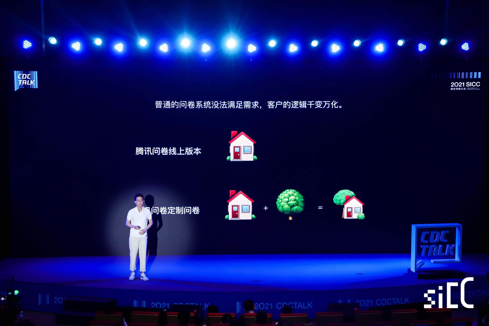
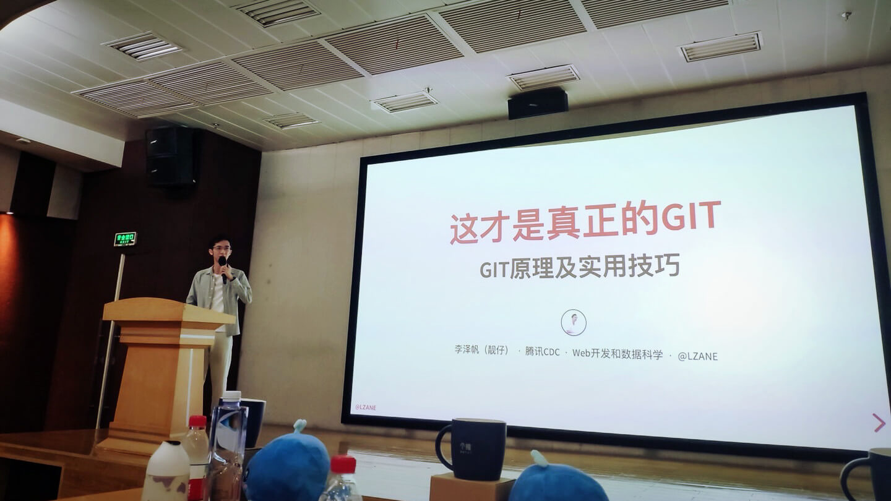

##  如何设计一门上万人使用的DSL —— 腾讯问卷DSL实践之路
[2021 TWEB 腾讯前端技术大会](https://tweb.tencent.com/#/) / 24 Nov 2021 / 深圳科兴国际会议中心

DSL（领域特定语言）的应用十分广泛，在某些场景下能够大幅度降低成本，提升效率。本次分享主要介绍腾讯问卷将DSL落地在问卷逻辑编写的经验，包括落地前中后期的问题， 如哪些是适合DSL落地的业务场景？DSL语法应该如何设计？parser应该如何设计？编辑器等配套设施应当如何搭建等等，让你更加深入的理解DSL，帮助业务降本增效。

文章 / [PPT](https://www.slideshare.net/zanelee2/tweb) / [视频（主办方收费）](https://ke.qq.com/course/3795873)

------

## 逆境的副产物
[2021 SICC服务创新大会](https://sicc.tencent.com/) / 16 May 2021 / 深圳腾讯滨海大厦

文章 / [视频](https://v.qq.com/x/cover/mzc00200e0q0xv7/k3254jfyuz0.html)

-------

##  这才是真正的GIT——GIT原理及实用技巧
[2019 freeCodeConf 深圳站](https://www.huodongxing.com/event/3518621095211) / 24 Nov 2019 / 深圳南山区腾讯大厦2楼多功能厅

[文章](/tech/git-internal) / [PPT](/slide/git-under-the-hood) / [视频](https://www.bilibili.com/video/av77252063)

------

##  我"码"由我不由天——谈谈前端测试的作用与实践
[RTC Dev Meetup：前端技术专场](https://www.huodongxing.com/event/6506528541100) / 31 Aug 2019 / 深圳南山区虚拟大学园触梦社区

文章 / [PPT](https://www.slideshare.net/zanelee2/ss-202955857) / [视频](https://www.bilibili.com/video/av67360515)
