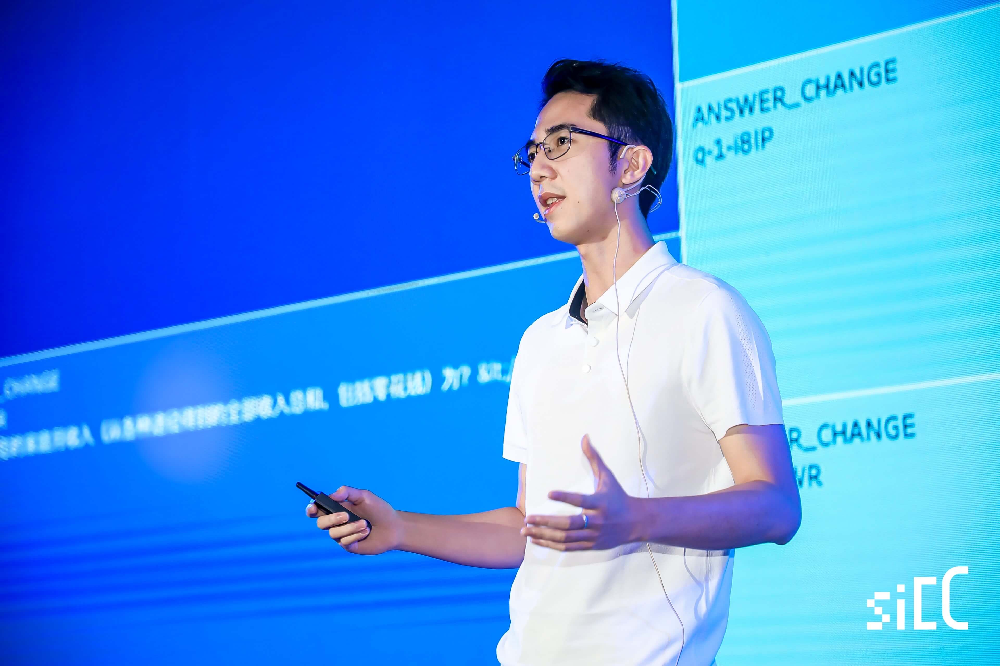

**我是谁 / Who I am:**

我叫李泽帆 (@LZANE)，目前的工作是一名前端工程师，毕业于中山大学，目前就职于[腾讯CDC](https://cdc.tencent.com/)。热爱IT技术，特别专注于web开发和数据科学，想成为一个终生学习者。

My name is LI ZEFAN (@LZANE), graduated from Sun Yat-sen University, currently working as a front-end developer in [CDC Tencent](https://cdc.tencent.com/). I dedicated to Web Development and Data Science, and want to be a permanent beta learner

**如何联系到我 / How to contact me:**

- Email: cn.zanelee [at] gmail.com
- Github: [@LZANE](https://github.com/lzane)
- Linkedin: [@LZANE](https://www.linkedin.com/in/lzane/)
- Telegrame: [@LZANE](https://t.me/lzane)
