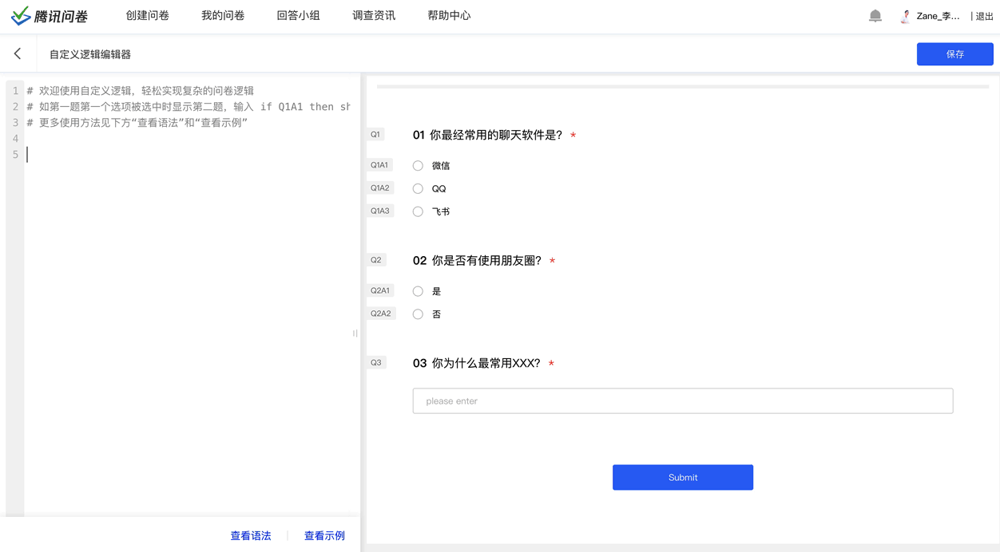
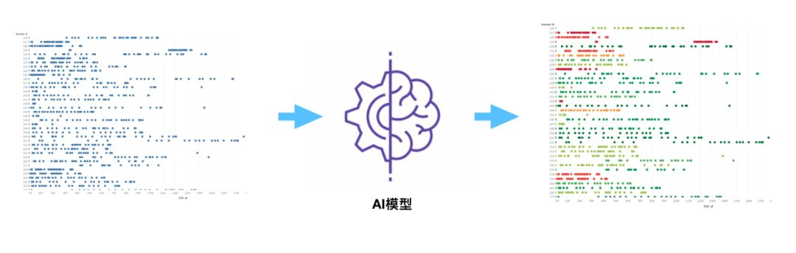

我做过哪些项目？

## 腾讯问卷DSL问卷逻辑语言

设计了一套描述问卷逻辑的DSL，并完成编译器和产品功能的实现，最终推动对外落地成为腾讯问卷的一个亮点功能，目前已经有超过2万名领域专家使用。

使用DSL可以快速地操作问卷底层能力，实现复杂的逻辑定制，降低定制问卷的成本，提高问卷逻辑设置的效率。

更多信息见：[https://wj.qq.com/docs/dsl/](https://wj.qq.com/docs/dsl/)

--------

## 基于用户行为的样本智能数据清洗

通过采集用户回答问卷时的答题行为（鼠标移动，点击，滚动等），经过特征工程提取特征后，训练一个AI模型，实现对问卷回收的样本清洗，帮助用户筛选出不认真答题的无效样本，以此来实现低成本、快速、易用的问卷样本清洗。

更多信息见：[https://wj.qq.com/article/single-379.html](https://wj.qq.com/article/single-379.html)

--------

## 腾讯问卷回答页
重构了腾讯问卷的回答页，支撑千万级的访问量和用户体验。

--------

## 腾讯投票小程序
使用同构技术实现了一份代码，多个小程序平台运行，支撑着千万级用户的访问。 
