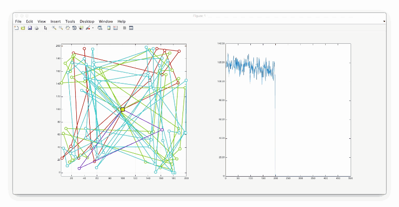

  

使用Matlab用模拟退火（SA）解决VRP问题。首先什么是VRP问题？

大家应该都知道旅行商问题（TSP，Traveling Salesman Problem），即求一个旅行家从一个仓库出发，通过沿途所有城市，再回到仓库所需要的最短路径。TSP问题中只有一个旅行商，那我们如何去解决有多个旅行商(车辆)同时送货的问题呢？

### VRP
这就引出了VRP问题，即在TSP问题的基础上，加上两个限定条件：

- 有多个旅行商（车辆）同时送货。
- 每个旅行商（车辆）能携带的货物量(capacity)。

也就是说，TSP问题是VRP问题的一个特例（不考虑capacity并且只有一辆车的情况）。

现在为了简化问题，我们先不考虑汽车容量，只考虑有多个旅行商（车辆）时我们应该如何解决这个问题。
下图是一个TSP问题的邻接矩阵 (D是仓库)

我们从[ABC]随机生成一个排列组合，然后再将D接到这个序列的两头即得出了一条路线。

现在考虑VRP问题，假设现在我们有两辆汽车，其实我们需要做的只是在原来的矩阵多加一行一列，然后把一辆车当成是城市，也可以理解成有多少辆车就有多少个仓库，但他们在地图上其实是一点，然后对[A B C D1]进行排列组合，即可得到:

然后把D2加到这个序列两头，就可以生成两条路线了（1. D-B-A-D 2.D-C-D）这样就把一个VRP问题装换成TSP问题了。

不过有两个方面要注意的：

- 生成的序列两头不能是D
- 不能有两个D连在一起

这两种情况都相当于少了一辆车

### 模拟退火 SA

首先看这张图，如果采用一般的贪心算法求最大值，那么当搜索到达A之后，就不会继续向前了，这就陷入了局部最优解。

SA模拟退火算法就是解决这个问题的一个办法，模仿金属冶炼时的退火过程，以一定概率接受一个更差一点的解，从而跳出局部最优解。

具体算法的实现请参照文末参考文献，这里只是简单带过

- 假设温度比设置的最低温度高 
- 假如生成的解比原来的解更优，则接受生成的较优解。
- 假如生成的解比原来的差，则计算 **P(dE)=exp(dE/(kT))**, 以一定的概率接受这个较差解，然后降温。
- 生成一个neighbor,重复整个过程。

生成neighbor的方法也多种多样，比如说：

- swap
- insert
- reverse

### Simulation
让我们来想一个特例，80座城市，分布在四个角上，仓库在正中间，总共有四辆车。那么路程最短的解很明显可以想象出是每辆车分别去访问一个角。matlab工程在文末附件部分给出，仿真结果如下：

观察下图,可以看出一开始温度较高的时候，容易接受一个比自己差一点的解，从而跳出局部最优解，随着时间推移，温度降下来之后，就基本上不能再接受比自己再差的解了。

###### 参考文献:

- "Improvement heuristics for the Vehicle Routing Problem based on Simulated Annealing" —— Alex Van Breedam

###### matlab工程代码:
https://github.com/lzane/VRP-using-SA-with-Matlab
