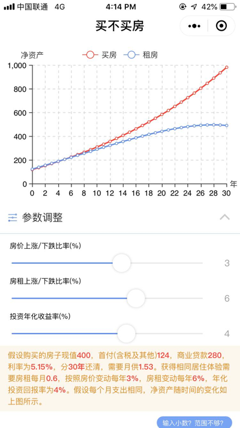

  

## TL;DR
买房还是租房？这个问题对于不同的人、地点、未来预期、房市走向、房租涨幅等，都会得到不一样的答案。希望能够通过计算未来所有时间点这两种选择对应的净资产，绘制成图表供对比，为买房或租房的人提供一些能够量化的计算结果。已将此功能做成小程序。

## 为什么要做这个小程序？

前段时间一直在思考一个问题，对于现在的自己，是买房还是继续租房好。一方面看着大家说现在房市在高位，一方面看着每年深圳房租蹭蹭蹭往上涨，一会觉得买房好，一会觉得这个租售比其实租房更划算。希望有一个能够量化的计算方法，帮助到自己比较一下这两种选择。

## 是如何计算得出结果的？

简单介绍一下计算方法。假设相同的现金流的情况下（一开始买房的付出首付，租房的将同样的首付拿去投资。后续每月买房的付出月供，租房的将同样的月供减去房租，剩余的用于投资），计算未来各个时间点下的净资产（买房净资产 = 房屋市价 - 银行欠款，租房净资产 = 退出投资能够获得的资金），再进行对比。

具体计算方法可以参照[Github仓库](https://github.com/lzane/buy-or-rent-house)中的Excel文件`/buy_or_rent_house.xlsx`。当然，这只是一种很大概的对比，仍然有很多因素没有考虑进来。

当我在Excel尝试了这个计算方法之后，我把他转换成图表，做成个小程序，方便使用和可视化，也可以直接把计算结果转发给家人或朋友帮忙参考。如果你有疑问或者有其他建议，可以在仓库中提issues。代码也开源在 https://github.com/lzane/buy-or-rent-house ，欢迎贡献。

希望这个工具能够帮到大家。如果有帮助到大家，请给我一个star🙏 

## 还有很多没有考虑的点
- 暂不考虑买房带来的归属感，对于自己的房子肯定体验是完全不一样的。
- 暂不考虑公积金部分
- 暂不考虑资金流动性的变化，包括限售政策等
- 等等

## TODO
- 添加公积金贷款的计算
