## TL;DR;
本文是我在[2021TWEB腾讯前端技术大会](https://tweb.tencent.com/)上分享的文字稿整理，包括一门DSL（领域特定语言）落地前中后期的经验和思考，如“哪些是适合DSL落地的业务场景？”、“DSL语法应该如何设计？”、“如何实现解析器Parser？”等等。可以帮助大家了解DSL这一技术，在下一次遇到技术选型的时候，有更大的武器库，如果可以通过创造一门DSL帮助你的业务降本增效，那就更好了。

如果你更加倾向于从视频中学习，可以观看
<iframe src="//player.bilibili.com/player.html?aid=402849551&bvid=BV1nV411g7nb&cid=1177488285&page=1" scrolling="no" border="0" frameborder="no" framespacing="0" allowfullscreen="true"> </iframe>

## 我们做了一个什么东西？
问卷逻辑大家应该不陌生，比如去年疫情，我们填过很多的健康上报，那么这样一份问卷可能会在第一道题询问你的体温，如果你的体温<37.2度，那么你的问卷会很短；如果你的体温>37.2度，那么可能会有接下来很多道题询问你的症状，是否离开过本省等等。

上面举的只是个简单的例子，而像我们部门CDC，在支持公司内外专业的用户研究和市场调研时，会有很多更加复杂的定制逻辑，没法使用一种简单的交互来完成。所以，我们创造了一门DSL，像下方的动图一样，只需在左边输入好DSL，即可完成问卷逻辑的设置，在右侧预览。

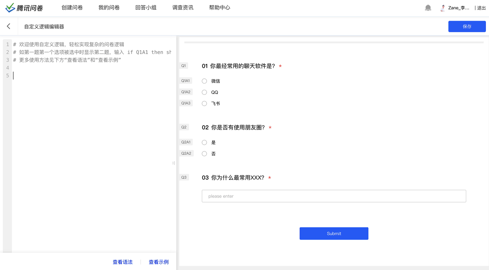

腾讯问卷的DSL支持多种自定义逻辑，目前已经帮助3万多名领域专家完成了9万多份问卷的复杂逻辑设置。对这个功能感兴趣的朋友可详见 https://wj.qq.com/docs/dsl/
<!-- 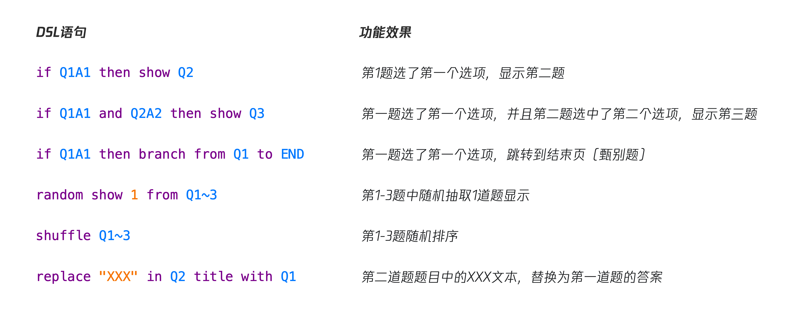 -->

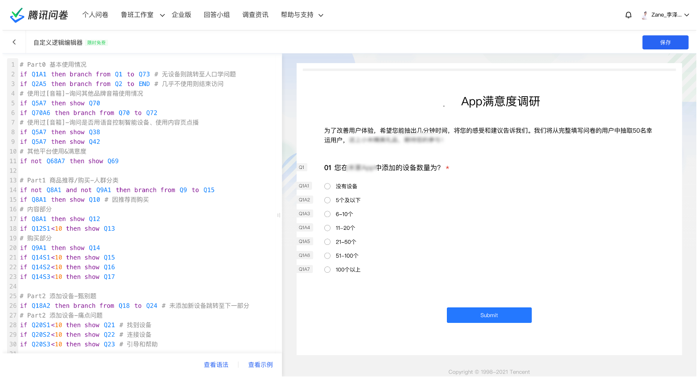

## 适合DSL落地的场景

这一章主要会讲有哪一些是适合DSL落地的一个场景，我会以腾讯问卷的实践经验为例子，**但大家不用太关注腾讯问卷的业务流程，而是要关注其中的分析方法，然后思考自己的业务场景是否也遇到了同样的问题，这些问题有没有可能使用DSL来达到降本增效的作用。**

腾讯问卷在支持公司内外专业用研需求时，有很多复杂的问卷逻辑，比如说下图这样一个例子，里面包括现实逻辑、跳转逻辑、引用逻辑、随机排序逻辑、加权随机抽取逻辑等等。

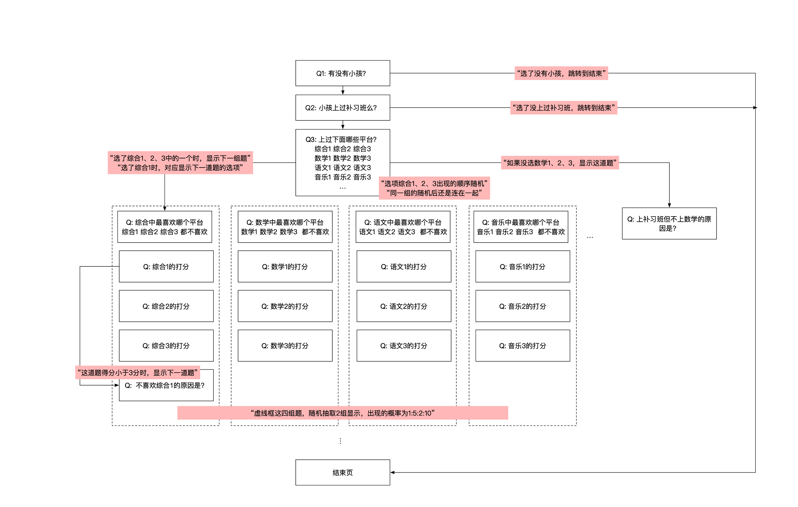

受限于当时腾讯问卷的功能限制，我们提出了一种名为定制问卷的解决方案，简单来说就是由对每一份定制问卷，在领域专家设计好这份问卷后，由开发同学去理解这部分逻辑，并写死在代码里面。这样子做带来的问题是显而易见的，最大的一个问题是定制一份问卷需要花费3个人天的研发资源，成本高，效率低。同时由于这个方案没有弹性，没法满足日益增长的定制问卷数量，并且没法支持到需要紧急投放的定制问卷。

所以我们需要提出新的解决方案来满足这部分需求，新的方案必须是成本较低、效率较高、并且具有弹性的一个方案。

所以我们重新分析了一下定制问卷的整个流程，首先**在这整个流程中沟通成本巨大**，每一次我们的领域专家（用户研究同学）设计好一份问卷后，要跟开发同学讲明白这个逻辑需要耗费巨大的沟通成本。而作为开发同学，由于我们缺乏领域特定的知识，并且每一份问卷的定制逻辑都是不同的，导致我们也比较难去理解逻辑需求。基本上我们会陷入下图所示的沟通循环。

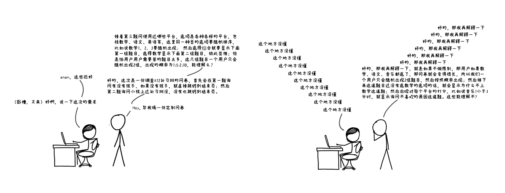

但是这部分的沟通成本真的是必要的么？其实我们很快发现：**领域专家清楚所有逻辑细节，只是因为它不会写代码，所以需要开发同学将其翻译成代码**，而在这个过程中，开发同学并没有补充额外的逻辑，整个需求的信息密度是不变的。这是一个适合DSL落地的一个场景。

接下来我们通过流程分析的方法审视了定制问卷的整个流程，如下图，我们可以发现**整个流程参与的角色非常多，而这必定带来大量的沟通和理解成本**。

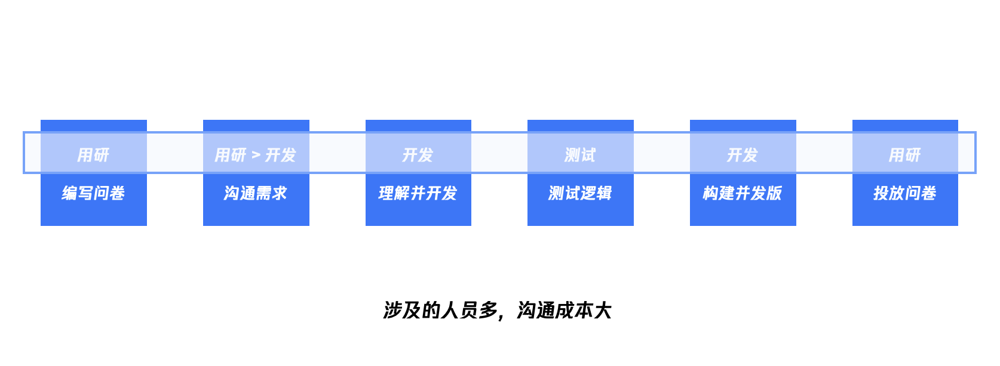

而对于开发而言，每个定制问卷都从头开发，**重复性工作多**。


并且每次都需要重复构建发版，想去掉这个流程我们的思路是**将一些“构建时”的工作后移到“运行时”**，而DSL天生就具有这一特性。


结合上面提到的点，我们最终采用了DSL为技术方案，使整个过程的参与的角色只有一个，并且步骤可以得到减少，满足我们的优化目标。

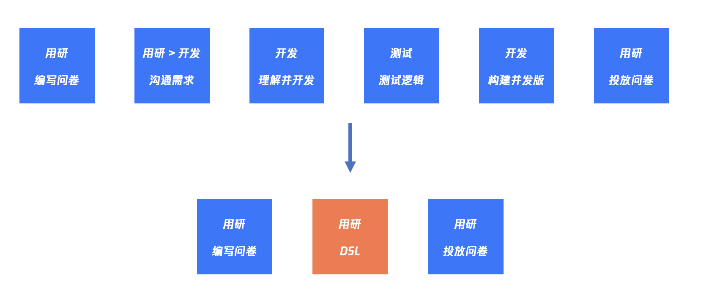

总结一下，上面提到的这几点是适合DSL落地的场景，或者说是适合DSL来解决的迹象：

1. **领域专家很清楚逻辑细节**
2. **重复性工作多**
3. **沟通成本大，参与角色多**
4. **“构建时”后移到“运行时”**
5. **过多的GUI操作**

前面4个点在上文中都已举例说明，第5个点“过多的GUI操作”这个在工具类的应用中会比较常用，下面我放两个动图可以让大家直观感受一下。

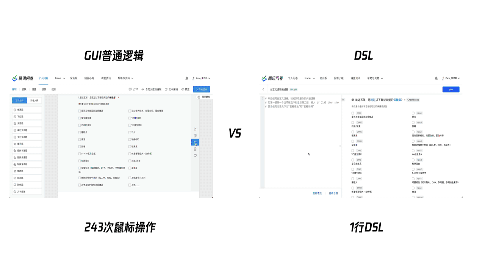

大家可以使用同样的方法分析一下自己的业务，如果可以命中其中的几个点，那么你可以考虑将DSL加入到你技术选型中作为一个选项。

## 实现DSL编译器

确定使用DSL来解决问题后，我们马上就会面临一个问题：我们如何开发一个解析器，来解析用户输入的DSL呢？

是不是我们要学习一整本恐龙书才能够做这件事？是不是我们要从头开发一个解析器？答案是不用的，计算机发展到现在，即使是我们常用的很多高级语言，也不会从头开发一个解析器，而是会使用解析器生成器。

### 解析器生成器

解析器生成器，顾名思义是它可以根据你定义好的语法，生成出对应的解析器，用以解析用户输入的DSL，而你只需要使用语法描述好你的DSL长什么样。在JS中有很多广泛使用的解析器生成器，包括`PEG.js`、`jison`、`antlr`等等，它们使用的解析算法、性能等等差异超出了本文的范畴，后面可以再开一篇文章来聊聊。

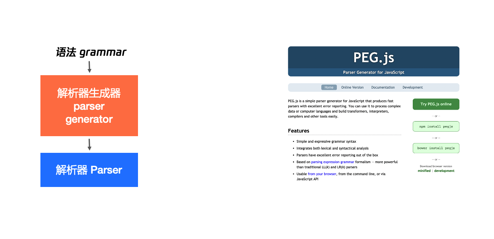

这里以`PEG.js`为例给大家简单介绍一下解析器生成器（Parser generator）,假设我们要设计一个DSL用来表达“n分钟之前”，使用JS我们会写成

```js
new Date(Date.now()-2*60*1000)
```

我们希望说可以实现一个解析器生成器，解析下方的DSL也能够得到同样的Date对象

```dsl
2 mins ago
```

我们先来看一个简单的demo

```js
const PEG = require("pegjs")
const grammar = `
Start
  = i:Integer _ "mins" _ "ago"
  
Integer "integer"
  = _ [0-9]+

_ "whitespace"
  = [ ]*
`

const parser = PEG.generate(grammar)
const result = parser.parse(process.argv[2])
console.log(result)
```

可以看到一个简单的解析器生成器包括
1. 定义好DSL的语法`grammar`
2. 调用`PEG.generate`得到一个解析器
3. 使用解析器去解析`parser.parse`用户输入的DSL

我们运行上面的代码，我们可以得到屏幕下方这样一个多维数组，它其实是个树状结构。

```bash
$ node demo.js "2 mins ago"
[ [ [], [ '2' ] ], [ ' ' ], 'mins', [ ' ' ], 'ago' ]
```

如下图，我将这个树状结构与语法中对应的语法用同样的颜色标注了出来。

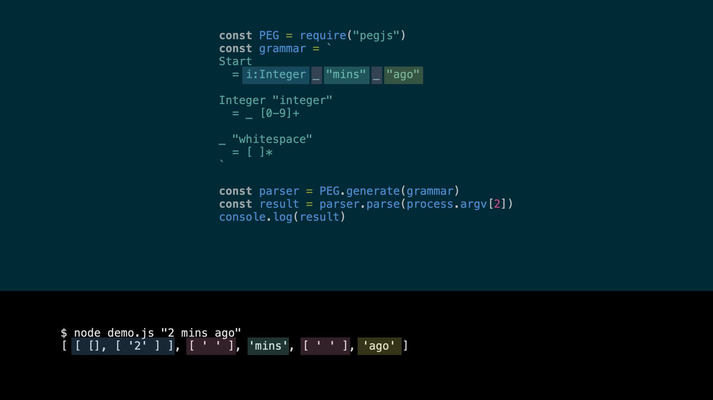

得益于PEG.js支持在语法中内嵌JS代码来帮助我们处理一下解析时的中间状态，此时如果我们想把数组中的第0位转化成int，只需要在grammar中内嵌JS代码

```js
const PEG = require("pegjs")
const grammar = `
Start
  = i:Integer _ "mins" _ "ago"
  
Integer "integer"
  = _ [0-9]+ { 
    return parseInt(text(), 10)
  }

_ "whitespace"
  = [ ]*
`

const parser = PEG.generate(grammar)
const result = parser.parse(process.argv[2])
console.log(result)
```

当我们再次执行上面的代码，我们可以发现数组的第0位已经变成一个int了

```bash
$ node demo.js "2 mins ago"
[ 2, [ ' ' ], 'mins', [ ' ' ], 'ago' ]
```

同样的思路，我们可以通过修改grammar，让其输出一个JS的Date对象

```js
const PEG = require("pegjs")
const grammar = `
Start
  = i:Integer _ "mins" _ "ago"{
    return new Date(Date.now()-i*60*1000)
  }
  
Integer "integer"
  = _ [0-9]+ { 
    return parseInt(text(), 10)
  }

_ "whitespace"
  = [ ]*
`

const parser = PEG.generate(grammar)
const result = parser.parse(process.argv[2])
console.log(result)
```

```bash
$ node demo.js "2 mins ago"
2021-06-20T12:07:03.960Z
```

如果我们想扩充我们的解析器生成器，让其同时支持解析"x hours ago"，只需要在grammar中，加入如下规则。

```js
const PEG = require("pegjs")
const grammar = `
Start
  = i:Integer _ u:Unit _ "ago"{
    return new Date(Date.now()-i*u)
  }
  
Unit "unit"
  = "mins" {
    return 60*1000
  } 
  / "hours" {
    return 60*60*1000
  }

Integer "integer"
  = _ [0-9]+ { 
    return parseInt(text(), 10)
  }

_ "whitespace"
  = [ ]*
`

const parser = PEG.generate(grammar)
const result = parser.parse(process.argv[2])
console.log(result)
```

至此，我们学会了如何使用一个解析器生成器来生成一个解析器。

当然我们只是介绍了一些简单的语法，PEG.js实际上非常强大，它可以实现将JS代码转换成AST的工作，并且配备了一个在线的Demo，大家感兴趣的话可以到 https://pegjs.org/online 尝试（JavaScript的PEG语法： https://raw.githubusercontent.com/pegjs/pegjs/master/examples/javascript.pegjs）

### 编辑器架构

整个架构大致如下图所示，我们使用解析器生成器配合我们DSL的语法生成出了解析器，再由解析器去解析用户输入的文本得到AST，经过转换器将其转换成为问卷运行的一个逻辑对象（配置），最后使用运行器去运行对应的逻辑。

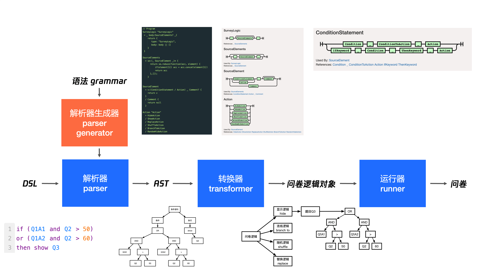

## DSL的语法设计

DSL的语法设计也是一个非常重要的事情，可以说**好的、符合习惯的DSL语法是最终这门DSL是否能够成功非常关键的一点，甚至还会成为整个行业的规范**，比如数据库领域的SQL。

我在语法设计里也踩了一个很大的坑，当时的我第一次设计语法，很容易就把语法设计得花里胡哨的，仿佛只有这样才能够体现自己的牛逼之处，而且我是**从一个程序员的习惯出发**去设计的，大概是下面的样子。

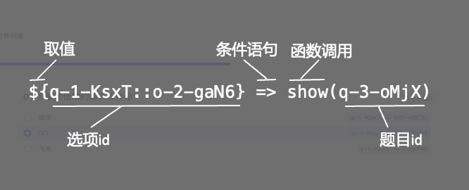

但发上线之后发现效果并不理想，虽然可以解决领域专家的问题，但他们并不是很愿意来使用，里面也充斥着大量的程序员的概念，比如“取值”、“函数调用”、“取引用”等等。

意识到这个问题之后，通过关心使用者的习惯和思考方式，我们使用**领域专家优先原则**开始重新设计语法，简单来说就是用他们日常说的话来设计语法，因为这是最契合他们日常表达和思考方式的，过程如下动图所示。


最终我们得到了如下新的语法，可以看到，新的语法更加像自然语言，更加符合使用者的习惯。

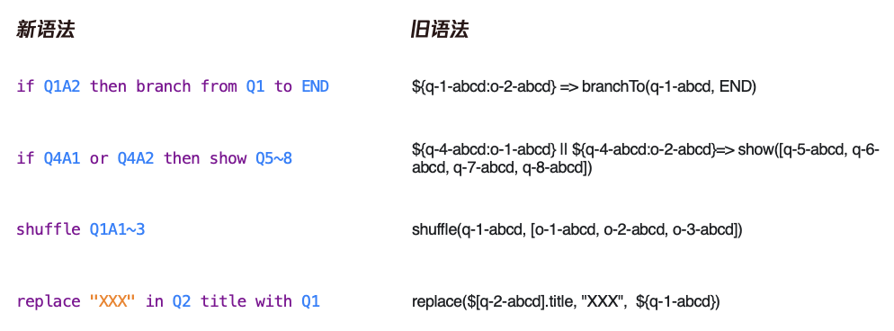

大家**在设计自己的DSL语法的时候，应该重点关注使用者的表达和感受。**

## DSL的配套设施

完成了前面这些步骤之后，其实你的DSL已经可以使用并帮助你提效了。那么有哪些方法可以提升使用者的一个编辑体验，从而让你的DSL更好地去做推广呢？有一下的配套设施可以考虑：

- **编辑器或IDE**，你需要一个所见即所得的编辑器，让用户在边输入DSL的时候边可以实时预览效果，方便用户尝试和调试，也包括自动补全、语法高亮等常见功能。（如本文开头的动图）
- **详尽、带有例子的帮助文档**，为了让用户更快地学习你的语言，你需要编写一份详尽的文档，并带上各种常用的例子，也有利于这门语言的传播。（如https://wj.qq.com/docs/dsl/）
- **错误提示**，当用户输入的DSL不符合语法规范时，你应该在错误位置给予明确提示，甚至可以提供修改方案。

## 克制！克制！克制！

本文用通篇来讲DSL的一个好处，那DSL是不是就是一个“银弹”呢？显然不是，甚至在大部分场景下，它都不会是一个最佳方案，所以我希望大家在创造自己的语言之前，思考一下这3个问题：

- **已经有能够高效解决问题的方案？** 如果有，那么DSL往往不是最优的办法，因为你需要花很多成本来开发编译器和配套设施，而使用者也要花时间来学习你这门新语法。
- **能否使用内部DSL？** 如果你的语言的使用对象有开发背景，那你可以考虑使用内部DSL来实现，这样你不用设计语法，不用开发编译器，只需要提供一个宿主语言的运行时，比如说jQuery。
- **领域里已有标准语法？** 如果有，请不要再给这个复杂的世界添乱了，而且使用标准语法也减少使用者的学习成本，比如说SQL、Excel里面的运行函数，如果能够你的需求且你的用户已经会使用了，就不要自己再创造新的语法了。

如果经过了这3个问题，你仍需要创造一门自定义语法的外部DSL语言，往往这个时候，这门语言也可以带给你巨大的效率提升，那就加油干吧。

## 更进一步地学习？
- [书籍] [Domain Specific Languages by Martin Fowler, with Rebecca Parsons](https://martinfowler.com/books/dsl.html)
