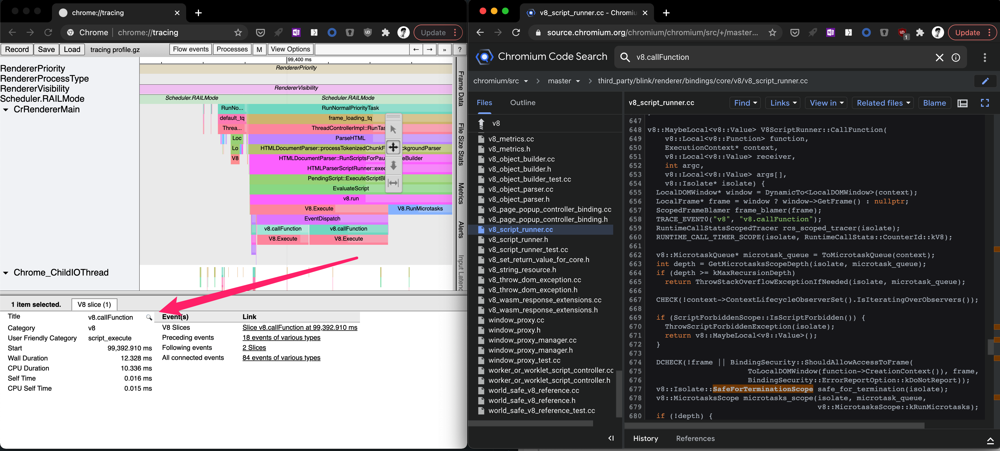
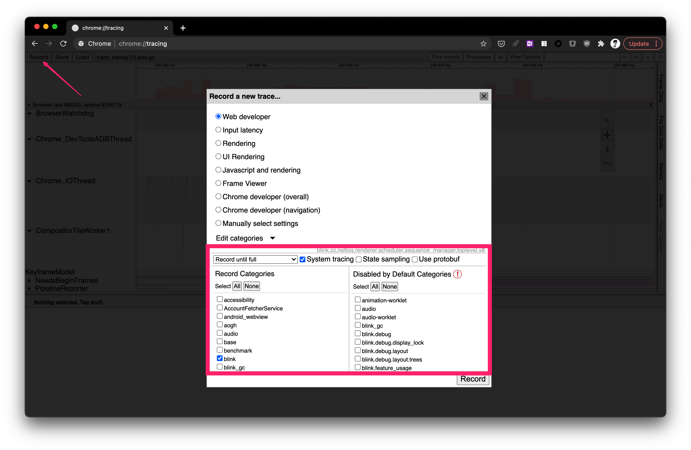

刚学前端那会学习事件循环，说事件循环存在的意义是由于 JavaScript 是单线程的，所以需要事件循环来防止JS阻塞，让网络请求等I/O操作不阻塞主线程。

而 Microtasks 是一类优先级比较高的任务，我们不能像 Macrotasks（宏任务） 一样插入 Macrotasks 队列末端，等待多个事件循环后才执行，而需要插入到 Microtasks 的队列里面，在本轮事件循环中执行。

比如下面这个有趣的例子：

```js
document.body.innerHTML = ` 
    <button id="btn" type="button">btn</button> 
`; 

const button = document.getElementById('btn')
 
button.addEventListener('click',()=>{
  Promise.resolve().then(()=>console.log('promise resolved 1'))
  console.log('listener 1')
})
 
button.addEventListener('click',()=>{
  Promise.resolve().then(()=>console.log('promise resolved 2'))
  console.log('listener 2')
})
 
// 1. 手动点击按钮 
// button.click() // 2. 解开这句注释，用JS触发点击行为
```

当我手动点击按钮的时候，大家觉得浏览器的输出是下面的A还是B？

- A. listener1 -> promise resolved 1 -> listener2 -> promise resolved 2 
- B. listener1 -> listener2 -> promise resolved 1 -> promise resolved 2

大家可以在这里试一下

[](https://codesandbox.io/s/naughty-morning-9hnr3?fontsize=14&hidenavigation=1&theme=dark)

当我将上面代码中的最后一行注释打开，使用JS触发点击行为的时候，浏览器的输出是A还是B？

大家觉得上面1、2两种情况的输出顺序是否一样？

答案非常有意思

- 当我们使用1. 手动点击按钮时，浏览器的输出是A
- 当我们使用2. 用JS触发点击行为时，浏览器的输出是B

# 接受大佬的知识

为什么会出现这种情况呢？ 这个 Microtasks 的运行时机有关。两年前当我带着这个问题搜索资料并询问大佬的时，大佬告诉我：

**当浏览器JS引擎调用栈弹空的时候，才会执行Microtasks队列**

按照这个结论，我使用 Chrome Devtool 中的 Performance 做了一次探索

## 人工点击按钮

人工点击的时候输出为 listener1 -> promise resolved 1 -> listener2 -> promise resolved 2 。 


- 从上图中我们可以看到，一次点击事件之后，浏览器会调用 Function Call 进入JS引擎，执行 listener1，输出`listener1`。
- 弹栈时发现JS调用栈为空，这时候就会执行 Microtasks 队列中的所有 Microtask，输出`promise resolved 1`。
- 接着浏览器调用 Function Call 进入JS引擎，执行 listener2，输出`listener 2`。
- 弹栈时发现JS调用栈为空，这时候就会执行 Microtasks 队列中的所有Microtask，输出`promise resolved 2`。

## JS触发点击事件

在JS代码中触发点击时输出为 listener1 -> listener2 -> promise resolved 1 -> promise resolved 2


- 从上图中我们可以看到，浏览器运行JS代码时，调用了 button.click 这个函数
- 进入事件处理，执行 listener1，输出`listener1`。
- 弹栈时发现JS调用栈非空（button.click函数还在运行）
- 执行 listener2，输出`listener 2`。
- 弹栈时发现JS调用栈为空，这时候就会执行 Microtasks 队列中的所有 Microtask，输出`promise resolved 1`、`promise resolved 2`。

## 探索工具

Chrome Devtool 中的 Performance 是一个 sample profiler (采样分析仪)，即它的运行机制是每1ms暂停一下vm，将当前的调用栈记录下来，最后利用这部分信息做出可视化。

由于它是一种 sample 的机制，所以在两个 sample 之间的运行状态可能会被丢失，所以我们在使用这个工具的时候可以

1. 使CPU变慢：在 Devtool 中打开 "CPU 6x slowdown"
2. 在要探索的函数中执行一段比较长的for循环占用CPU时间（如上面的 heavy）

强烈建议大家学会使用这个工具，本文例子的 profile 结果文件也会文章最后给到大家，大家有兴趣可以导入试一试。

# 探索V8源码

两年的时间过去了，在上周整理笔记的时候，我开始质疑这一个知识，"当浏览器 JS 引擎调用栈弹空的时候，才会执行 Microtasks 队列"。

因为它其实是个表现，我想知道浏览器和 JS 引擎到底是怎么实现这样的机制的。

因此我使用`chrome://tracing`进行探索，

> 下面探索基于 Chrome Version 88.0.4324.192 (Official Build) (x86_64)，不同浏览器的实现有不同

## 人工点击按钮


- 从上图中我们可以看到，一次点击事件之后，Blink（Blink是一个渲染引擎，Chrome 的 Renderer 进程中的主线程大部分时间会在 Blink 和 V8 两者切换）会调用 v8.callFunction 进入 V8 引擎，执行 listener1，输出`listener1`。
- 返回 Blink 时发现 V8 调用栈为空，这时候就会执行 V8.RunMicrotasks 执行 Microtasks 队列中的所有 Microtask，输出`promise resolved 1`。
- Blink 调用 v8.callFunction 进入 V8 引擎，执行 listener2，输出`listener 2`。
- 返回 Blink 时发现 V8 调用栈为空，这时候就会执行 Microtasks 队列中的所有 Microtask，输出`promise resolved 2`。

> 注意，chrome://tracing 中的`v8.xxx`小写v开头的为 Blink 的调用，`V8.xxx`大写的V才是真正的V8引擎。

### 详细源码

tracing 工具还有一个非常好用的功能，点击下图中的放大镜，就可以直接打开 Chromium Code Search 查看 Chromium 的源码。这个工具也自带搜索功能，可以查看函数的声明、定义以及调用。



> 下面源码的探索基于commit e8b6574c 的Chromium，并且为了简化隐藏了无关的代码，用...替代

比如我们在上面的 tracing 里面看到有`v8.callFunction`的调用，我们点击可以找到这个这个函数调用，是在 Blink 中调用 V8 的入口。

[third_party/blink/renderer/bindings/core/v8/v8_script_runner.cc](https://source.chromium.org/chromium/chromium/src/+/master:third_party/blink/renderer/bindings/core/v8/v8_script_runner.cc;l=648;drc=e8b6574c887a6c78c7e77ba4ee1bb70da9b18e2b)

```cpp
v8::MaybeLocal<v8::Value> V8ScriptRunner::CallFunction(
   v8::Local<v8::Function> function,
   ExecutionContext* context,
   v8::Local<v8::Value> receiver,
   int argc,
   v8::Local<v8::Value> args[],
   v8::Isolate* isolate 
){
  ... 
  TRACE_EVENT0("v8", "v8.callFunction"); // 这就是我们在 tracing 中看到的 v8.callFunction
  ...
  v8::MicrotaskQueue* microtask_queue = ToMicrotaskQueue(context); // 拿到 microtask 队列
  ...
  v8::MicrotasksScope microtasks_scope(isolate, microtask_queue,
                                       v8::MicrotasksScope::kRunMicrotasks); // 这个 scope 很可疑，这里构造之后在这个函数后面并没有使用
  ... 
  probe::CallFunction probe(context, function, depth);
  v8::MaybeLocal<v8::Value> result =
      function->Call(isolate->GetCurrentContext(), receiver, argc, args); // 函数调用
  CHECK(!isolate->IsDead());
  ...
}
```

这里类型为`v8::MicrotasksScope`的变量很可疑，在创建之后并没有在后续的函数里面使用，所以我们来看一下他的声明和定义

[v8/include/v8.h](https://source.chromium.org/chromium/chromium/src/+/master:v8/include/v8.h;l=7500;drc=6dd90e4f92a8eb811114180ccc74d99b2c46ee7d)  

```cpp
/**
 * This scope is used to control microtasks when MicrotasksPolicy::kScoped
 * is used on Isolate. In this mode every non-primitive call to V8 should be
 * done inside some MicrotasksScope.
 * Microtasks are executed when topmost MicrotasksScope marked as kRunMicrotasks
 * exits.
 * kDoNotRunMicrotasks should be used to annotate calls not intended to trigger
 * microtasks.
 */
class V8_EXPORT V8_NODISCARD MicrotasksScope {
 public:
  enum Type { kRunMicrotasks, kDoNotRunMicrotasks };

  MicrotasksScope(Isolate* isolate, Type type);
  MicrotasksScope(Isolate* isolate, MicrotaskQueue* microtask_queue, Type type);
  ~MicrotasksScope(); // 注意这个析构函数
  ...
```

上面这段注释告诉我们，这个类是用来控制 Microtasks 的（当 `MicrotasksPolicy::kScoped` 这个策略被使用的时候，我们在后面会拎出来讲，这里大家先默认 Blink 是设置了这个策略）。

这里的析构函数非常的可疑，因为我们在前面一步发现变量`microtasks_scope`创建之后并没有在后续的函数里面使用，而析构函数会在变量被销毁时执行。我们继续来看 `v8::MicrotasksScope` 的定义

[v8/src/api/api.cc](https://source.chromium.org/chromium/chromium/src/+/master:v8/src/api/api.cc;l=9069;drc=6dd90e4f92a8eb811114180ccc74d99b2c46ee7d) 

```cpp
MicrotasksScope::~MicrotasksScope() {
  if (run_) {
    microtask_queue_->DecrementMicrotasksScopeDepth(); // 这里将函数调用栈减少一层
    if (MicrotasksPolicy::kScoped == microtask_queue_->microtasks_policy() && // 这里检查策略是否是 MicrotasksPolicy::kScoped
        !isolate_->has_scheduled_exception()) {
      DCHECK_IMPLIES(isolate_->has_scheduled_exception(),
                     isolate_->scheduled_exception() ==
                         i::ReadOnlyRoots(isolate_).termination_exception());
      microtask_queue_->PerformCheckpoint(reinterpret_cast<Isolate*>(isolate_)); // 这一步尝试执行 Microtasks 队列
    }
  }
  ...
}
```

[v8/src/execution/microtask-queue.cc](https://source.chromium.org/chromium/chromium/src/+/master:v8/src/execution/microtask-queue.cc;l=113;drc=6dd90e4f92a8eb811114180ccc74d99b2c46ee7d)

```cpp 
void MicrotaskQueue::PerformCheckpoint(v8::Isolate* v8_isolate) {
  if (!IsRunningMicrotasks() && !GetMicrotasksScopeDepth() && // 注意，这一步检查了调用栈是否为空
      !HasMicrotasksSuppressions()) {
    Isolate* isolate = reinterpret_cast<Isolate*>(v8_isolate);
    RunMicrotasks(isolate); // 执行队列中的Microtasks
    isolate->ClearKeptObjects();
  }
}

...

int MicrotaskQueue::RunMicrotasks(Isolate* isolate) {
  ...
    {
      TRACE_EVENT_CALL_STATS_SCOPED(isolate, "v8", "V8.RunMicrotasks"); // 我们在 tracing 里面也可以看到这个输出
      maybe_result = Execution::TryRunMicrotasks(isolate, this,
                                                 &maybe_exception);
      processed_microtask_count =
          static_cast<int>(finished_microtask_count_ - base_count);
    } 
  ...
}
```

到这里我们就知道了 Microtasks 的运行时机了，**当 V8 执行完调用要返回 Blink 时，由于 MicrotasksScope 作用域失效，在其析构函数中检查 JS 调用栈是否为空，如果为空的话就会运行 Microtasks**。

下图为完整的调用路径


观察到的现象即是 "当浏览器 JS 引擎调用栈弹空的时候，才会执行 Microtasks 队列"

所以现在我如果问你，是不是 Macrotasks（宏任务）执行完才会执行 Microtasks 呢? 答案显然是否定的，如同这个例子，我们的 Macrotask 是处理点击输入，而 Microtasks 在其中被执行了两次。

## JS触发点击事件


用JS触发点击事件其实也是同理的，同样是使用`V8::MicrotasksScope`的析构函数来进行调用，只是前面几次都因为调用栈非空（`GetMicrotasksScopeDepth`），所以等到最后面才执行。

## V8::MicrotasksPolicy

那是不是所有使用V8引擎的应用 Microtasks 的运行时机都是一样的呢？答案是否定的，Microtasks 的运行时机是由`V8::MicrotasksPolicy`来决定的。

[v8/include/v8.h](https://source.chromium.org/chromium/chromium/src/+/master:v8/include/v8.h;l=7406;drc=6dd90e4f92a8eb811114180ccc74d99b2c46ee7d)
```cpp
/**
 * Policy for running microtasks:
 *   - explicit: microtasks are invoked with the
 *               Isolate::PerformMicrotaskCheckpoint() method;
 *   - scoped: microtasks invocation is controlled by MicrotasksScope objects;
 *   - auto: microtasks are invoked when the script call depth decrements
 *           to zero.
 */
enum class MicrotasksPolicy { kExplicit, kScoped, kAuto };
```

由上面的源码注释我们可以知道

- `explicit`模式下，由应用自己主动调用才会运行 Microtasks。目前 Node 是使用了这种策略。
- `scoped`模式下，由`MicrotasksScope`控制，但作用域失效时，在其析构函数中运行 Microtasks。目前 Blink 是使用这种策略，如下面的代码段为 Blink 设置 MicrotasksPolicy。
- `auto`模式为 V8 的默认值，当调用栈为空的时候就会执行 Microtasks

[third_party/blink/renderer/bindings/core/v8/v8_initializer.cc](https://source.chromium.org/chromium/chromium/src/+/master:third_party/blink/renderer/bindings/core/v8/v8_initializer.cc;l=644;drc=6dd90e4f92a8eb811114180ccc74d99b2c46ee7d)
```cpp
static void InitializeV8Common(v8::Isolate* isolate) {
  ...
  isolate->SetMicrotasksPolicy(v8::MicrotasksPolicy::kScoped);
  ...
}
```

## 探索工具

chrome://tracing/ 是一个 structural profiler 或叫 CPU profiler，与 Chrome Devtool performance 的 sample profiler 不同，他是由代码中主动的去埋点打印出来的，所以每一次函数调用都会被记录下来，不会像sample profiler一样漏掉采样时刻之间的状态。

使用方法如下，首先进入 chrome://tracing 点击右上角的 Record，勾选住你想 profile 的组件。



然后去到你的 demo 页执行你想要探索的操作，回到 tracing 页面点 Stop，接着在 Processes 里面筛选掉其他 Tab（标签页）的信息。

最后使用键盘 w（放大）s（缩小）a（左移）d（右移）探索

强烈建议大家学会使用这个工具，本文例子的 profile 结果文件也会文章最后给到大家，大家有兴趣可以导入试一试。

# 总结

Event Loop（事件循环）是前端工程师经常讨论到的话题，往深挖可以挖出 JS 如何实现异步、requestAnimationFrame、浏览器渲染机制、Macrotasks、Microtasks等等问题。

本文主要探索了Microtasks的运行时机，我从两年前被动接受知识 "当浏览器JS引擎调用栈弹空的时候，才会执行 Microtasks 队列"

到两年后主动使用工具深入探索源码后了解到的 "当 V8 执行完调用要返回 Blink 时，由于 MicrotasksScope 作用域失效，在其析构函数中检查 JS 调用栈是否为空，如果为空就会运行 Microtasks。"

这也是计算机最吸引我的地方，**当你每隔一段时间回来看一个东西的时候，都能够更往深一步，发现到更神奇的原理，也可以够感受到自己的进步**。

在探索的过程中还使用了一些工具，如 Chrome Devtool Performance、Chrome tracing、Chromium Code Search 等，希望感兴趣的同学，也可以使用这些工具，更深入的探索浏览器内部原理。

# 附件
- [Demo 例子的 HTML](https://raw.githubusercontent.com/lzane/LZANE-blog/article/microtask/content/tech/event-loop-microtask/demo/microtasks.html)
- [Demo 例子的 Chrome Devtool Performace Profile](https://raw.githubusercontent.com/lzane/LZANE-blog/article/microtask/content/tech/event-loop-microtask/demo/performance%20profile.json)
- [Demo 例子的 Chrome Tracing Profile （筛选使用 Renderer (pid 38256) ）](https://raw.githubusercontent.com/lzane/LZANE-blog/article/microtask/content/tech/event-loop-microtask/demo/tracing%20profile.gz)
