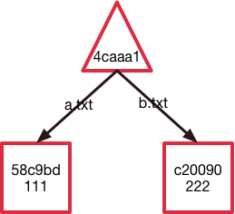
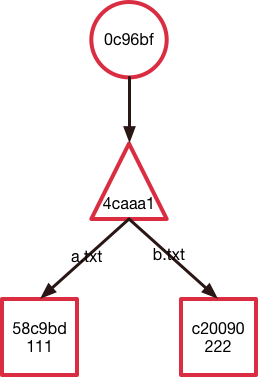
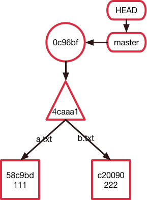
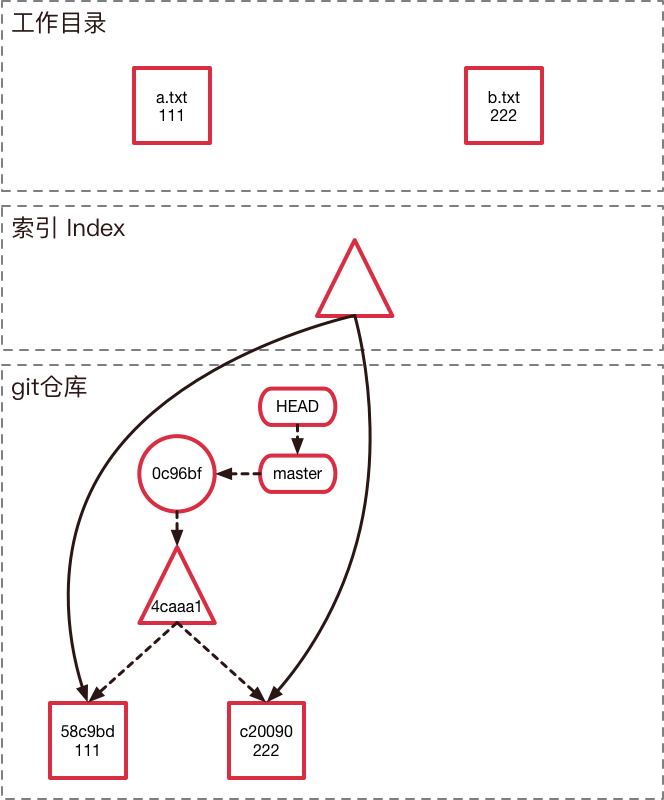
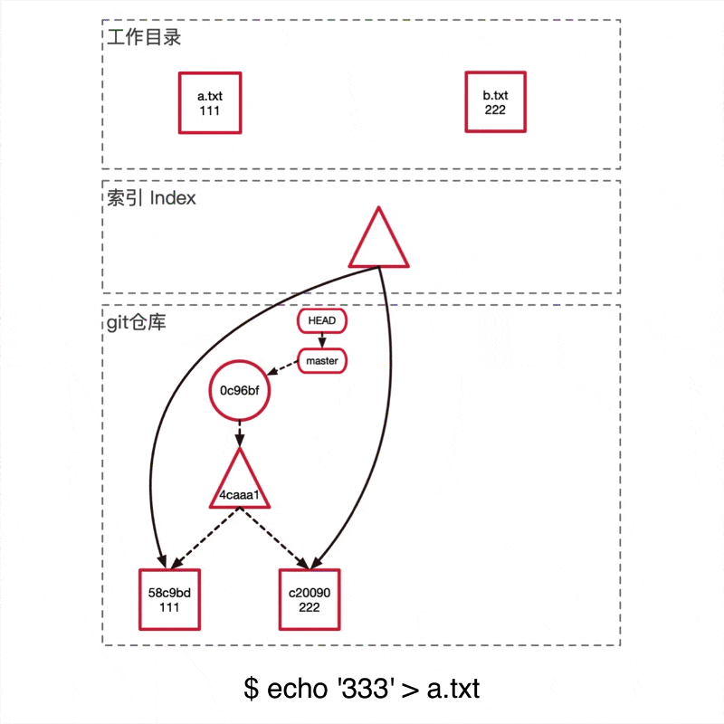
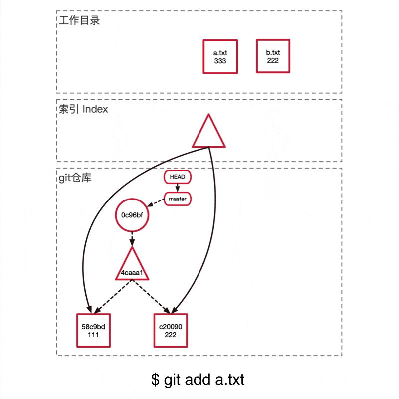
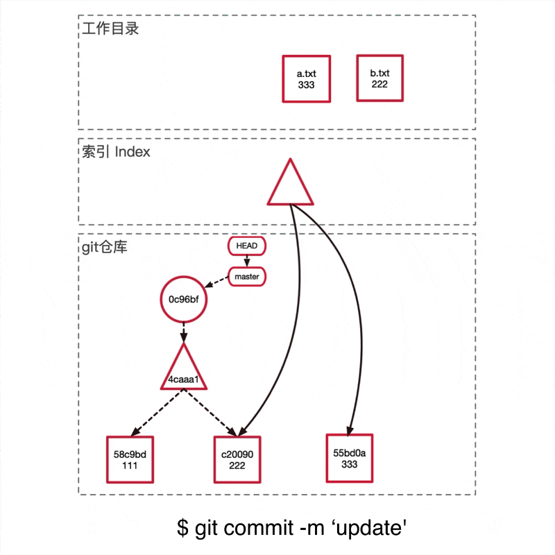

## Git是怎么储存信息的
这里会用一个简单的例子让大家直观感受一下git是怎么储存信息的。

首先我们先创建两个文件

```shell
$ mkdir test_git && cd test_git
$ git init
$ echo '111' > a.txt
$ echo '222' > b.txt
$ git add *.txt
```

我们知道Git会将整个数据库储存在`.git/`目录下，如果你此时去查看`.git/objects`目录，你会发现Git仓库里面多了两个object。

```shell
$ tree .git/objects
.git/objects
├── 58
│   └── c9bdf9d017fcd178dc8c073cbfcbb7ff240d6c
├── c2
│   └── 00906efd24ec5e783bee7f23b5d7c941b0c12c
├── info
└── pack
```

让我们来看一下里面存的是什么东西

```shell
$ cat .git/objects/58/c9bdf9d017fcd178dc8c073cbfcbb7ff240d6c
xKOR0a044K%
```

很遗憾，我们只能得到一串乱码，这是因为Git将信息压缩成二进制文件。但是不用担心，因为Git也提供了一个能够帮助你探索它的api `git cat-file [-t] [-p]`， `-t`可以查看这个object是什么类型的，`-p`可以查看这个object储存的具体内容。

根据上面拿到的一个object的身份证（SHA1），我们运行下这两个指令可以发现这个object是一个blob类型的节点，他的内容是111，也就是说这个object储存着a.txt的文件内容。

```shell
$ git cat-file -t 58c9
blob
$ git cat-file -p 58c9
111
``` 

这里我们遇到第一种Git object，blob类型，它只储存的是一个文件的内容，不包括文件名等其他信息。然后将这些信息经过SHA1哈希算法得到对应的哈希值
58c9bdf9d017fcd178dc8c073cbfcbb7ff240d6c，作为这个object在Git仓库中的唯一身份证。

也就是说，我们此时的Git仓库是这样子的：


我们继续探索，我们创建一个commit。

```shell
$ git commit -am '[+] init'
$ tree .git/objects
.git/objects
├── 0c
│   └── 96bfc59d0f02317d002ebbf8318f46c7e47ab2
├── 4c
│   └── aaa1a9ae0b274fba9e3675f9ef071616e5b209
...
```

我们会发现当我们commit完成之后，Git仓库里面多出来两个object。同样使用`cat-file`命令，我们看看它们分别是什么类型以及具体的内容是什么。

```
$ git cat-file -t 4caaa1
tree
$ git cat-file -p 4caaa1
100644 blob 58c9bdf9d017fcd178dc8c0... 	a.txt
100644 blob c200906efd24ec5e783bee7...	b.txt
```

这里我们遇到了第二种Git object类型——tree，它将当前的目录结构打了一个快照。从它储存的内容来看可以发现它储存了一个目录结构（类似于文件夹），以及每一个文件（或者子文件夹）的权限、类型、对应的身份证（SHA1值）、以及文件名。

为什么要把文件的权限和文件名储存在tree object里面而不是glob object呢？想象一下修改一个文件的命名。

如果将文件名保存在glob里面，那么Git只能多复制一份原始内容形成一个新的glob object。而Git的实现方法只需要创建一个新的tree object将对应的文件名更改成新的即可，原本的glob object可以复用，节约了空间。

此时的Git仓库是这样的：



```
$ git cat-file -t 0c96bf
commit
$ git cat-file -p 0c96bf
tree 4caaa1a9ae0b274fba9e3675f9ef071616e5b209
author lzane 李泽帆  1573302343 +0800
committer lzane 李泽帆  1573302343 +0800
[+] init
```

接着我们发现了第三种Git object类型——commit，它储存的是一个提交的信息，包括对应目录结构的快照tree的哈希值，上一个提交的哈希值（这里由于是第一个提交，所以没有父节点。在一个merge提交种还会出现多个父节点），当前提交的作者以及提交的具体时间，最后是该提交的信息。

此时我们去看Git仓库是这样的：



到这里我们就知道Git是怎么储存一个提交的信息的了，那有同学就会问，我们平常接触的分支信息储存在哪里呢？

```
$ cat .git/HEAD
ref: refs/heads/master

$ cat .git/refs/heads/master
0c96bfc59d0f02317d002ebbf8318f46c7e47ab2
``` 

在Git仓库里面，HEAD、分支、普通的Tag可以理解成是一个指针，指向对应commit的SHA1值。



其实还有第四种Git object，类型是tag，在添加含附注的tag（`git tag -a`）的时候会新建，这里不详细介绍，有兴趣的朋友按照上文中的方法可以深入探究。

至此我们知道了Git是什么储存一个文件的内容、目录结构、commit信息和分支的。其本质上是一个key-value的数据库加上默克尔树形成的链子（这里可以蹭一下区块链的热度，区块链的数据结构也使用了默克尔树）。

在下篇文章中将会涉及Git的三个分区（工作目录、Index 索引区域、Git仓库），以及Git链是怎么形成的。了解这三个分区和Git链的内部原理之后可以对Git的众多指令有一个视觉的理解，不会再经常搞混。


## Git的三个分区








