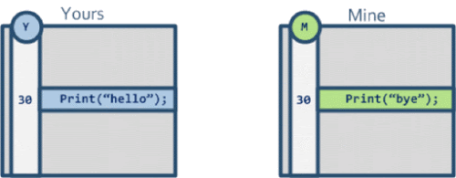

“合并前文件还在的，合并后就不见了”、“我遇到Git合并的bug了” 是两句经常听到的话，但真的是Git的bug么？或许只是你的预期不对。本文通过讲解三向合并和Git的合并策略，step by step介绍Git是怎么做一个合并的，让大家对Git的合并结果有一个准确的预期，并且避免发生合并事故。

> 这是一个系列的文章，计划包括三篇：
> 
> - [这才是真正的Git——Git内部原理](https://www.lzane.com/tech/git-internal/)
> - 这才是真正的Git——分支合并【当前这篇文章】
> - 这才是真正的Git——Git实用技巧（暂未完成）

## 故事时间
在开始正文之前，先来听一下这个故事。

如下图，小明从节点A拉了一条dev分支出来，在节点B中新增了一个文件http.js，并且合并到master分支，合并节点为E。这个时候发现会引起线上bug，赶紧撤回这个合并，新增一个revert节点E'。过了几天小明继续在dev分支上面开发新增了一个文件main.js，并在这个文件中import了http.js里面的逻辑，在dev分支上面一切运行正常。可当他将此时的dev分支合并到master时候却发现，**http.js文件不见了**，导致main.js里面的逻辑运行报错了。但这次合并并没有任何冲突。他又得重新做了一下revert，并且迷茫的怀疑是Git的bug。

两句经常听到的话：

—— ”合并前文件还在的，合并后就不见了“

—— ”我遇到Git的bug了“

相信很多同学或多或少在不熟悉Git合并策略的时候都会发生过类似上面的事情，明明在合并前文件还在的，为什么合并后文件就不在了么？一度还怀疑是Git的bug。这篇文章的目的就是想跟大家讲清楚Git是怎么去合并分支的，以及一些底层的基础概念，从而避免发生如故事中的问题，并对Git的合并结果有一个准确的预期。

## 如何合并两个文件
在看怎么合并两个分支之前，我们先来看一下怎么合并两个文件，因为两个文件的合并是两个分支合并的基础。

大家应该都听说过“三向合并”这个词，不知道大家有没有思考过为什么两个文件的合并需要三向合并，只有二向是否可以自动完成合并。如下图

很明显答案是不能，如上图的例子，Git没法确定这一行代码是我修改的，还是对方修改的，或者之前就没有这行代码，是我们俩同时新增的。此时Git没办法帮我们做自动合并。

所以我们需要三向合并，所谓三向合并，就是找到两个文件的一个合并base，如下图，这样子Git就可以很清楚的知道说，对方修改了这一行代码，而我们没有修改，自动帮我们合并这两个文件为 Print("hello")。

接下来我们了解一下什么是冲突？冲突简单的来说就是三向合并中的三方都互不相同，即参考合并base，我们的分支和别人的分支都对同个地方做了修改。

## Git 的合并策略

了解完怎么合并两个文件之后，我们来看一个使用 git merge 来做分支合并。如上图，将master分支合并到feature分支上，会新增一个commit节点来记录这次合并。

Git会有很多合并策略，其中常见的是Fast-forward、Recursive 、Ours、Theirs、Octopus。下面分别介绍不同合并策略的原理以及应用场景。默认Git会帮你自动挑选合适的合并策略，如果你需要强制指定，使用`git merge -s <策略名字>`

了解Git合并策略的原理可以让你对Git的合并结果有一个准确的预期。

### Fast-forward

Fast-forward是最简单的一种合并策略，如上图中将some feature分支合并进master分支，Git只需要将master分支的指向移动到最后一个commit节点上。

Fast-forward是Git在合并两个没有分叉的分支时的默认行为，如果不想要这种表现，想明确记录下每次的合并，可以使用`git merge --no-ff`。

### Recursive

Recursive是Git分支合并策略中最重要也是最常用的策略，是Git在合并两个有分叉的分支时的默认行为。其算法可以简单描述为：递归寻找路径最短的唯一共同祖先节点，然后以其为base节点进行递归三向合并。说起来有点绕，下面通过例子来解释。

如下图这种简单的情况，圆圈里面的英文字母为当前commit的文件内容，当我们要合并中间两个节点的时候，找到他们的共同祖先节点（左边第一个），接着进行三向合并得到结果为B。（因为合并的base是“A”，下图靠下的分支没有修改内容仍为“A”，下图靠上的分支修改成了“B”，所以合并结果为“B”）。

但现实情况总是复杂得多，会出现历史记录链互相交叉等情况，如下图

当Git在寻找路径最短的共同祖先节点的时候，可以找到两个节点的，如果Git选用下图这一个节点，那么Git将无法自动的合并。因为根据三向合并，这里是是有冲突的，需要手动解决。（base为“A“，合并的两个分支内容为”C“和”B“）

而如果Git选用的是下图这个节点作为合并的base时，根据三向合并，Git就可以直接自动合并得出结果“C”。（base为“B“，合并的两个分支内容为”C“和”B“）

作为人类，在这个例子里面我们很自然的就可以看出来合并的结果应该是“C”（如下图，节点4、5都已经是“B”了，节点6修改成“C”，所以合并的预期为“C”）

那怎么保证Git能够找到正确的合并base节点，尽可能的减少冲突呢？答案就是，Git在寻找路径最短的共同祖先节点时，如果满足条件的祖先节点不唯一，那么Git会继续递归往下寻找直至唯一。还是以刚刚这个例子图解。

如下图所示，我们想要合并节点5和节点6，Git找到路径最短的祖先节点2和3。

因为共同祖先节点不唯一，所以Git递归以节点2和节点3为我们要合并的节点，寻找他们的路径最短的共同祖先，找到唯一的节点1。

接着Git以节点1为base，对节点2和节点3做三向合并，得到一个临时节点，根据三向合并的结果，这个节点的内容为“B”。

再以这个临时节点为base，对节点5和节点6做三向合并，得到合并节点7，根据三向合并的结果，节点7的内容为“C”

至此Git完成递归合并，自动合并节点5和节点6，结果为“C”，没有冲突。

Recursive策略已经被大量的场景证明它是一个尽量减少冲突的合并策略，我们可以看到有趣的一点是，对于两个合并分支的中间节点（如上图节点4，5），只参与了base的计算，而最终真正被三向合并拿来做合并的节点，只包括末端以及base节点。

需要注意Git只是使用这些策略尽量的去帮你减少冲突，如果冲突不可避免，那Git就会提示冲突，需要手工解决。（也就是真正意义上的冲突）。

### Ours & Theirs

Ours和Theirs这两种合并策略也是比较简单的，简单来说就是保留双方的历史记录，但完全忽略掉这一方的文件变更。如下图在master分支里面执行`git merge -s ours dev`，会产生蓝色的这一个合并节点，其内容跟其上一个节点（master分支方向上的）完全一样，即master分支合并前后项目文件没有任何变动。

而如果使用theirs则完全相反，完全抛弃掉当前分支的文件内容，直接采用对方分支的文件内容。

这两种策略的一个使用场景是比如现在要实现同一功能，你同时尝试了两个方案，分别在分支是dev1和dev2上，最后经过测试你选用了dev2这个方案。但你不想丢弃dev1的这样一个尝试，希望把它合入主干方便后期查看，这个时候你就可以在dev2分支中执行`git merge -s ours dev1`。

### Octopus

这种合并策略比较神奇，一般来说我们的合并节点都只有两个parent（即合并两条分支），而这种合并策略可以做两个以上分支的合并，这也是git merge两个以上分支时的默认行为。比如在dev1分支上执行`git merge dev2 dev3`。

他的一个使用场景是在测试环境或预发布环境，你需要将多个开发分支修改的内容合并在一起，如果不用这个策略，你每次只能合并一个分支，这样就会导致大量的合并节点产生。而使用Octopus这种合并策略就可以用一个合并节点将他们全部合并进来。

## Git rebase

`git rebase` 也是一种经常被用来做合并的方法，其与git merge的最大区别是，他会更改变更历史对应的commit节点。

如下图，当在feature分支中执行rebase master时，Git会以master分支对应的commit节点为起点，新增两个**全新**的commit代替feature分支中的commit节点。其原因是新的commit指向的parent变了，所以对应的SHA1值也会改变，所以没办法复用原feature分支中的commit。（这句话的理解需要[这篇文章](https://www.lzane.com/tech/git-internal/)的基础知识）

对于合并时候要使用git merge还是git rebase的争论，我个人的看法是没有银弹，根据团队和项目习惯选择就可以。git rebase可以给我们带来清晰的历史记录，git merge可以保留真实的提交时间等信息，并且不容易出问题，处理冲突也比较方便。唯一有一点需要注意的是，不要对已经处于远端的多人共用分支做rebase操作。

我个人的一个习惯是：对于本地的分支或者确定只有一个人使用的远端分支用rebase，其余情况用merge。

rebase还有一个非常好用的东西叫interactive模式，使用方法是`git rebase -i`。可以实现压缩几个commit，修改commit信息，抛弃某个commit等功能。比如说我要压缩下图260a12a5、956e1d18，将他们与9dae0027合并为一个commit，我只需将260a12a5、956e1d18前面的pick改成“s”，然后保存就可以了。

限于篇幅，git rebase -i 还有很多实用的功能暂不展开，感兴趣的同学可以自己研究一下。

## 总结

现在我们再来看一下文章开头的例子，我们就可以理解为什么最后一次merge会导致http.js文件不见了。根据Git的合并策略，在合并两个有分叉的分支（上图中的D、E‘）时，Git 默认会选择Recursive策略。找到D和E’的最短路径共同祖先节点B，以B为base，对D，E‘做三向合并。B中有http.js，D中有http.js和main.js，E’中什么都没有。根据三向合并，B、D中都有http.js且没有变更，E‘删除了http.js，所以合并结果就是没有http.js，没有冲突，所以http.js文件不见了。

这个例子理解原理之后解决方法有很多，这里简单带过两个方法：1. revert节点E'之后，此时的dev分支要抛弃删除掉，重新从E'节点拉出分支继续工作，而不是在原dev分支上继续开发节点D；2. 在节点D合并回E’节点时，先revert一下E‘节点生成E’‘（即revert的revert），再将节点D合并进来。

Git有很多种分支合并策略，本文介绍了Fast-forward、Recursive、Ours/Theirs、Octopus合并策略以及三向合并。掌握这些合并策略以及他们的使用场景可以让你避免发生一些合并问题，并对合并结果有一个准确的预期。

希望这篇文章对大家有用，感兴趣的同学可以逛一逛我的博客 www.lzane.com 或看看我的其他文章。

## 参考
- 三向合并 http://blog.plasticscm.com/2016/02/three-way-merging-look-under-hood.html
- Recursive合并【视频】https://www.youtube.com/watch?v=Lg1igaCtAck
- 书籍 [Scott Chacon, Ben Straub - Pro Git-Apress (2014) ](https://git-scm.com/book/en/v2) 
- 书籍 [Jon Loeliger, Matthew McCullough - Version Control with Git, 2nd Edition - O’Reilly Media (2012)](https://www.amazon.com/Version-Control-Git-collaborative-development/dp/1449316387/ref=sr_1_1) 

