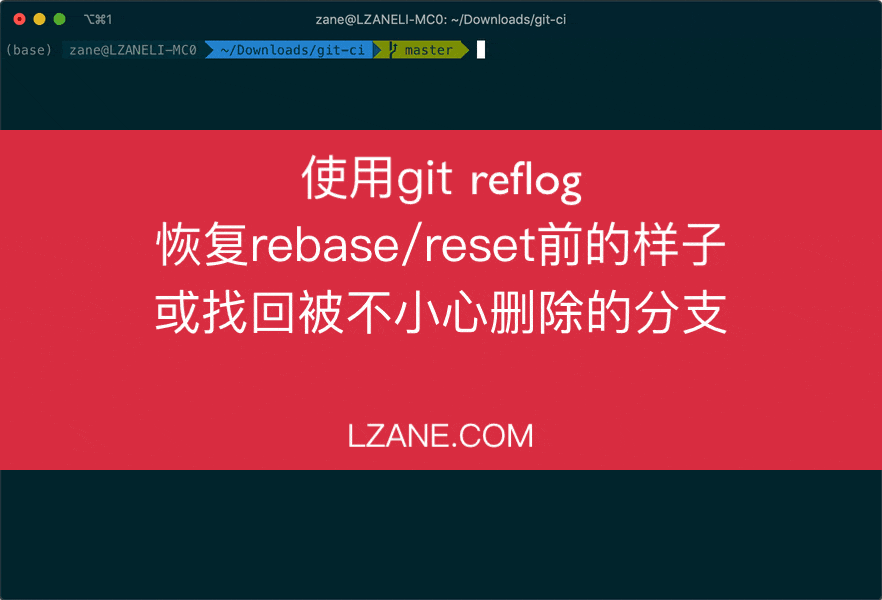
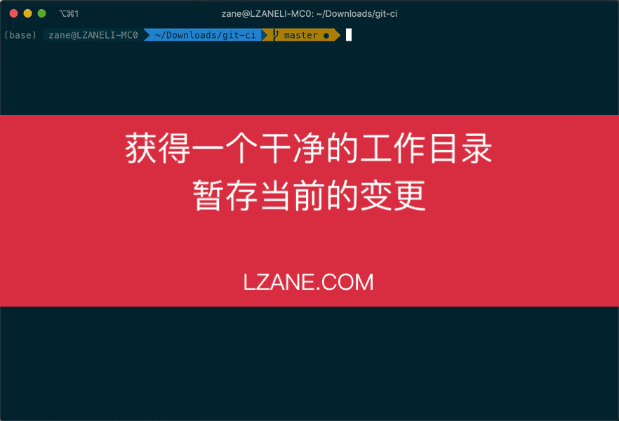
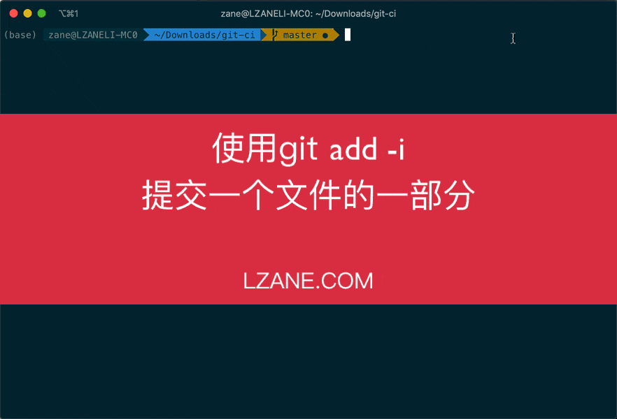
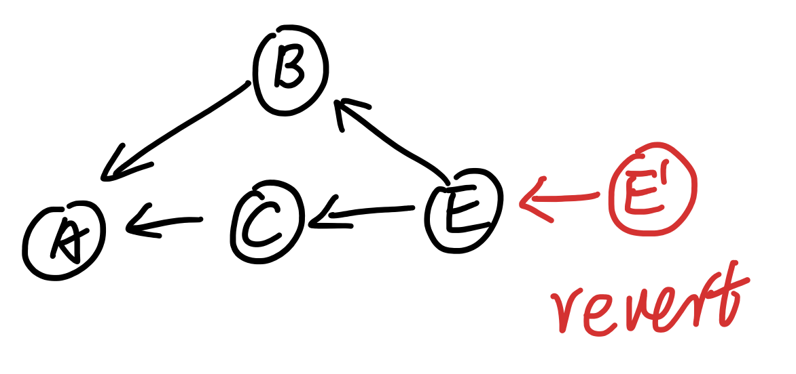
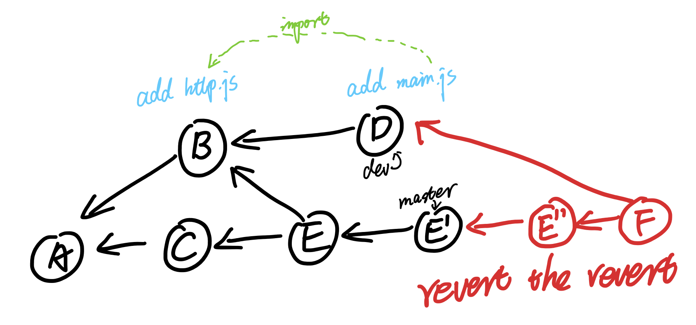

本篇是这个系列的最后一篇文章，之前的文章主要讲的是基础原理部分，在理解原理的基础上，介绍一些实用的技巧给大家，希望能提高大家的开发效率。


> 这是一个系列的文章，总共包括三篇：
> 
> - [这才是真正的Git——Git内部原理](/tech/git-internal/)
> - [这才是真正的Git——分支合并](/tech/git-merge/)
> - 这才是真正的Git——Git实用技巧【当前这篇文章】


这篇文章因为更多的是列举实际应用的技巧，所以文章结构会显得散乱一些，也不会像前两篇文章那样要求大家顺序阅读。每个点都是互相独立的，大家可以根据自己的需要学习。

在这篇文章里我会使用**操作录屏**的方式来介绍例子，希望这种方式可以让你更直观的了解命令的使用方法。

## 将几个commit压缩成一个


⚠️ 这里有一点要特别注意的是：**rebase会导致新的commit节点产生**，所以切记不要对多人共用的远端分支进行rebase。

`rebase -i` 是个很实用且应用广泛的工具，希望大家都学会它的使用。它还可以用来修改commit信息，抛弃某些commit，对commit进行排序等等。具体命令如下，操作方式跟动图一致，都是在vim里面进行编辑。这里不展开，感兴趣的同学可以自己操作一下。

```plain
# Commands:
# p, pick <commit> = use commit
# r, reword <commit> = use commit, but edit the commit message
# e, edit <commit> = use commit, but stop for amending
# s, squash <commit> = use commit, but meld into previous commit
# f, fixup <commit> = like "squash", but discard this commit's log message
# x, exec <command> = run command (the rest of the line) using shell
# d, drop <commit> = remove commit
# l, label <label> = label current HEAD with a name
# t, reset <label> = reset HEAD to a label
# m, merge [-C <commit> | -c <commit>] <label> [# <oneline>]
# .       create a merge commit using the original merge commit's
# .       message (or the oneline, if no original merge commit was
# .       specified). Use -c <commit> to reword the commit message.
```

另外如果要合并的是最近的几个commit，我们还可以用`git reset --soft HEAD~3 && git commit -m 'xxx'`来实现。对这个有问题的同学可以参照[Git内部原理](/tech/git-internal/)强调的可视化方法思考一下。

## 找回丢失的commit节点或分支

像上一步rebase后发现不符合预期，如何恢复？不小心删除了一个分支，如何找回？

> “学会这个技能，你的同事会请你喝奶茶的，而且说不定还能收获妹子。”  —— 来自往期课程的某位同学



主要思路为：**找到要返回的commit object的哈希值，然后执行`git reset`恢复**。

我们知道Git的出现就是为了尽量保证我们的操作不被丢失，在[Git内部原理](/tech/git-internal/)中我们讲过，git object是旦被创建，就不可变更，所以只要找到它对应的哈希值，就能找回。但是ref呢？在[Git内部原理](/tech/git-internal/)中我们也讲过，它是一个可变的指针，比如说你在master中提交了一个commit，那当前的master这个ref就会指向新的commit object的哈希值。reflog 就是将这些可变指针的历史给记录下来，可以理解成 **ref的log**，也可以理解成 **版本控制的版本控制**。

## 获得一个干净的工作空间

当我们实验一种思路，或者跟朋友讲代码时，我们可能会随意的修改代码。而当我们回到正常的开发时，我们需要一个干净的工作目录，即保证目前工作目录跟Git最后一次commit的文件是一致的。我们可以怎么做？



**尽量少用会丢失文件的操作，除非你能够确定不再需要这些文件。**

## 修改最近一个commit

commit完发现有一些临时的log忘记去掉？有一些文件忘记添加？commit信息出现错别字？


也可以使用 `git reset HEAD~`，然后执行你需要的修改，再commit即可，同上面介绍的命令效果是相同的。

## 提交一个文件中的部分修改



Git interactive add 还有很多功能，也推荐大家有时间可以尝试一下。

## 禁止修改多人共用的远端分支

如果一条远端分支有多人共用，那么不要在上面执行reset、rebase等会修改这条分支已经存在的commit object的命令。


具体的解释参照这篇文章 [Rebase and the golden rule explained](https://www.daolf.com/posts/git-series-part-2/) 。

## 撤销一个合并

如果是一个本地分支，仅需`git reset --hard <合并前的SHA1>`即可。

如果这个分支已经被推送到远端，比如说合并进master，发到线上才发现有bug需要回滚。这时分支有可能已经被其他人所使用，根据“禁止修改多人共用的远端分支”，你需要执行`git revert -m 1 <合并的SHA1>`，新增一个revert节点，如下图中的E'。



但要注意不要在原特性分支继续开发，而应该删除原来的分支，从E'节点拉出新分支做bug修复等。

如果在原特性分支上继续开发，则在合并回master的时候需要做一次revert操作revert掉E'节点，变成E‘’（如下图），不然很容易出现丢失文件等问题。具体原因分析参照[分支合并中的总结](/tech/git-merge/?#%E6%80%BB%E7%BB%93)



## 从整个历史中删除一个文件

代码要开源了，但发现其中包括密钥文件或内网ip怎么办？

```bash
git filter-branch --tree-filter 'rm -f passwords.txt' HEAD
```

可以使用filter-branch命令，它的实现原理是将每个commit checkout出来，然后执行你给它的命令，像上面的`rm -f passwords.txt`，然后重新commit回去。

⚠️ 这个操作属于高危操作，会修改历史变更记录链，产生全新的commit object。所以执行前请通知仓库的所有开发者，执行后所有开发者从新的分支继续开发，弃用以前的所有分支。

## 其他好用的命令
下面这些命令也是比较实用的命令，感兴趣的同学可以自己学习一下。

- `git bisect` 二分查找出现问题的变更节点，比如你发现当前提前下测试是不通过的，但HEAD～10（10个提交前）的测试是可以通过的，就可以用`git bisect` 来帮你定位到出现问题的变更点。
- `git blame` 查看某行代码最后是谁修改的。
- `git show-branch` 直观的展示多条分支间的关系。
- `git subtree` 拆分或合并仓库。

-------

希望大家读完有所收获。感兴趣的同学可以阅读同系列的其他文章

- [这才是真正的Git——Git内部原理](/tech/git-internal/)
- [这才是真正的Git——分支合并](/tech/git-merge/)

## 参考
- 书籍 [Scott Chacon, Ben Straub - Pro Git-Apress (2014) ](https://git-scm.com/book/en/v2) 
- 书籍 [Jon Loeliger, Matthew McCullough - Version Control with Git, 2nd Edition - O’Reilly Media (2012)](https://www.amazon.com/Version-Control-Git-collaborative-development/dp/1449316387/ref=sr_1_1)
- [Rebase and the golden rule explained](https://www.daolf.com/posts/git-series-part-2/)