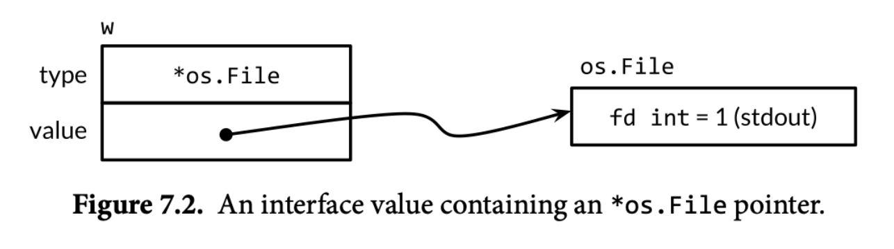

## 背景
同事在群里发了一个GPT定位bug的case，里面有段涉及Golang type assertion的代码，我之前以为编译后的二进制文件已经没有类型信息，又觉得不可能因为Golang有反射，趁机简单探究一下原理。

## 问题

```go
package main

import (
  "fmt"
)

var i interface{}

func foo(){
  i = float64(2.0)
  fmt.Print(i.(float32))
}

func main() {
  foo()
}
```

比如上面这段Golang代码，我们知道在运行的时候会报错

```plain
panic: interface conversion: interface {} is float64, not float32
```

Golang的runtime是怎么进行类型断言的？

## 前置知识

golang中对于空方法的interface的数据结构为`eface`，[源码](https://github.com/golang/go/blob/5152be3959d4aa273932c12da971d14e7f84405d/src/runtime/runtime2.go#L209C1-L212C2) （有方法的会使用`iface`）

```go
type eface struct {
	_type *_type
	data  unsafe.Pointer
}
```

附上一张 "The Go Programming Language" Interface 章节的配图


`_type`是一个`Type`的指针，`Type`为Golang在runtime时类型的表现，拥有一个类的信息 [源码](https://github.com/golang/go/blob/5152be3959d4aa273932c12da971d14e7f84405d/src/internal/abi/type.go#L20)

```plain
type Type struct {
	Size_       uintptr
	PtrBytes    uintptr // number of (prefix) bytes in the type that can contain pointers
	Hash        uint32  // hash of type; avoids computation in hash tables
	TFlag       TFlag   // extra type information flags
	Align_      uint8   // alignment of variable with this type
	FieldAlign_ uint8   // alignment of struct field with this type
	Kind_       uint8   // enumeration for C
	// function for comparing objects of this type
	// (ptr to object A, ptr to object B) -> ==?
	Equal func(unsafe.Pointer, unsafe.Pointer) bool
	// GCData stores the GC type data for the garbage collector.
	// If the KindGCProg bit is set in kind, GCData is a GC program.
	// Otherwise it is a ptrmask bitmap. See mbitmap.go for details.
	GCData    *byte
	Str       NameOff // string form
	PtrToThis TypeOff // type for pointer to this type, may be zero
}
```

## 汇编

对可执行文件使用`objdump`做反汇编，省略掉一些无关的操作，并对操作进行注释

```plain
0000000000497660 <main.foo>:
...
# 将float64的 _type* 放入main.i这个eface的_type
497681: lea    0xa6b8(%rip),%rax  # 4a1d40 <type.*+0x9d40>
497688: mov    %rax,0xb36a1(%rip)  # 54ad30 <main.i> 
...
# 把.rodata中储存2.0的指针放入main.i这个eface的data
49769c: lea    0x41135(%rip),%rax  # 4d87d8 <$f64.bfe62e42fefa39ef+0x10>
4976a3: mov    %rax,0xb368e(%rip)  # 54ad38 <main.i+0x8>

# 比较eface的_type跟float32的_type是否相等（指针是否指向同个Type）
4976aa: mov    0xb367f(%rip),%rax  # 54ad30 <main.i>
4976b1: mov    0xb3680(%rip),%rcx  # 54ad38 <main.i+0x8>
4976b8: lea    0xa641(%rip),%rdx  # 4a1d00 <type.*+0x9d00>
4976bf: nop
4976c0: cmp    %rax,%rdx

# 如果相等，跳到497733，会在后续执行runtime.panicdottypeE，输出报错信息
4976c3: jne    497733 <main.foo+0xd3>
...
49770c: callq  4911c0 <fmt.Print>
497711: mov    0x40(%rsp),%rbp
497716: add    $0x48,%rsp
49771a: retq
...
497733: mov    %rax,(%rsp)
497737: mov    %rdx,0x8(%rsp)
49773c: lea    0xda5d(%rip),%rax  # 4a51a0 <type.*+0xd1a0>
497743: mov    %rax,0x10(%rsp)
497748: callq  40a120 <runtime.panicdottypeE>
49774d: nop
49774e: callq  4625c0 <runtime.morestack_noctxt>
497753: jmpq   497660 <main.foo>
```

可见Golang在runtime中每一个类会有唯一的一个`Type`，位于`.rodata`区域，这也是Golang在二进制中储存类型信息的位置。

如上面例子4a1d40是`float64`的`Type`，4a1d00是`float32`的`Type`，查看`.rodata`可以看到如下信息，对应着上面`Type`的类型定义，包含48个byte。
```plain
4a1d00 04000000 00000000 00000000 00000000  ................
4a1d10 d33ec2b0 0704040d 98294c00 00000000  .>.......)L.....
4a1d20 0b874d00 00000000 dc160000 60640000  ..M.........`d..
4a1d30 00000000 00000000 10000000 00000000  ................
4a1d40 08000000 00000000 00000000 00000000  ................
4a1d50 fb7fa22e 0708080e a0294c00 00000000  .........)L.....
4a1d60 0b874d00 00000000 e7160000 a0640000  ..M..........d..
4a1d70 00000000 00000000 10000000 00000000  ................
```

在做类型断言的时候检查interface中`_type`是否与目标类型一致，如果不一致则panic。
