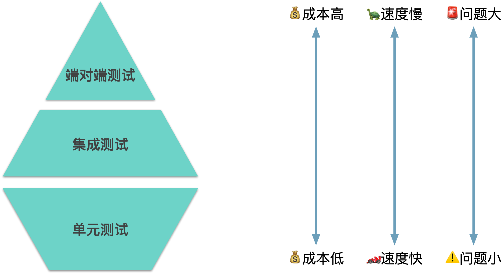

## 引入
忙碌了大半年，好不容易有机会跟老板要到一次休假机会，开开心心的带着女朋友飞到了马来西亚。你们俩坐在拥有世界最美夕阳的丹绒亚路海滩上，等待着落日的到来，一个多么浪漫的场景。

突然你的电话响了，公司测试的同学告诉你说你负责的一个页面出了bug，需要紧急修复。没办法你只能掏出电脑去修复这个bug，不一会儿你发现这个bug其实很好修复你很快就修复完了，正当你以为可以结束这个事的时候。你被告知**“由于你修复了这个bug，引入了其他另外两个bug”**

没办法你只能继续修复，周围的气氛也在微微的变化，如果你还是没法在短时间内修复，下场可能就是...

(!! 这里要有个动画)

## 前端测试的分类
一般来说我们会将前端测试分成三类:

- 单元测试(Unit Tests)：对一个最小单元例如一个函数，一个类，通过确认它的输入输出来保证表现是符合预期的。
- 集成测试(Intergration Tests)：一系列单元组合在一起表现是否符合预期，一般包括副作用。
- 端对端测试(E2E Tests)：在真实的浏览器环境中，通过编写自动化脚本，保证功能正常。

单元测试是成本最低，速度最快的，这里说的成本低包括开发维护成本低，运行所需要的算力低。一般来说单元测试和集成测试都是可以在开发阶段给开发人员提供实时反馈的。而端对端测试则成本最高，运行速度最慢，因为端对端测试需要真实的运行环境，浏览器环境，以及网络请求等等，所以其没法在开发阶段给开发人员提供实时反馈。

那么可能有同学会问，既然单元测试是成本最低，速度最快的，那我们是不是可以**只写单元测试，而不去使用集成测试和端对端测试?**

**答案肯定是不行的**

(!! 动图要加文字)

也就是说，单元测试->集成测试->端对端测试，可以覆盖的问题面越广，能够覆盖的点就越多。

## 前端测试的作用
### 消除恐惧，提升信心
前端测试的第一要义是**提升信心**，通过测试覆盖提高你对代码的把控能力，使你不再畏惧修改代码。

比如在紧急修复线上bug的时候，如果有一套比较完善的测试覆盖，那么你的开发流程可以是：**修bug->测试通过->发布**，不用担心牵一发动全身，因为有一系列的测试来保证你修改代码后，测试覆盖到的功能表现仍然是符合预期的。

(!! 一张动图)

### 帮助代码做重构优化
试想一个场景，当你接手一个你涉及混乱的模块，并且这个模块没有测试覆盖。这个时候假如要你来修复一个bug或添加一个功能，你会选择：

- A：对这个模块进行一定的重构和优化，然后再在逻辑清晰的代码中修复bug或添加功能。
- B：在这个模块中找到一个合适的位置，添加一个if statement来修复bug或添加功能。

我想大部分人都会选择B吧，原因并非大家没发现这个模块逻辑混乱，也不是因为大家不知道如何进行优化，而是因为这部分**代码没有测试覆盖，修改风险大，改挂了又要我背锅**。更可怕的是，由于每个人都这样想，这个模块会走向一个错误的方向，导致这个模块越来越复杂，逻辑越来越混乱，并最终需要花大量时间和精力来重写它。

> Leave your code better than you found it.  < Boy Scout Rule >

而如果这个模块是有测试覆盖的，就如这个线团用人在两段贴上了标签，你知道从IN-A点进入一定会从OUT-A点出来（通过确定输入输出来保证模块符合预期）。那当一位同学发现这里逻辑设计混乱，有不合理的地方的时候，他去做优化，做修改的心理负担将会大大降低，因为他知道，进过重构优化后的代码仍然是能够满足当初作者对它的设计的。

从而整个模块就会往一个正确的方向发展，进过一次次的重构优化，变得可维护并且易于修改。

而如果你不幸接受了一个设计混乱且没有测试覆盖的模块，并且你也有去重构优化它的想法时。测试也能帮你一个大忙，帮你更加自信的去做重构，降低修改后模块表现跟修改前不一致的可能性。如果Martin Fowler在Refactoring一书中提到，“在你开始重构之前，保证你有一系列稳健，并可以自动运行的测试”。

（题外话，强烈建议如果没读过这本书的同学去细读一下这本书，会带给你很多practical的重构优化的方法，并且本书第二版使用javascript作为演示代码，对前端同学来说非常友好。）

### 开发阶段实时反馈

覆盖了前端测试还可以在开发阶段给你一个实时的反馈，你没改动一行代码，测试框架马上会告诉你，你的这部分修改，会不会导致代码运行起来不符合之前的预期，你也可以提前收到这部分反馈，而不会像往常一样需要等到提测甚至发版之后才有别人告知这个问题。**减少上下文切换的次数，大幅度提升效率。**

### 时间更有价值

我是非常讨厌修bug的一个人，因为修bug给我的感受是一个一次性的工作，debug找到问题需要花费很长的时间，而最后修复这个bug往往只需要一点点修改，但你回过来看这段时间，你会发现这段时间的投入，除了增加一点点的定位bug的能力以外，不管是对于其他人或是以后的你，都可以说是没有多大价值的。

而写测试则不然，通过写测试我们是可以切切实实的为团队留下这部分测试代码作为团队的资产，并且在以后的每一次运行中，帮你反复检查并保证覆盖到的代码是满足设计预期的。**写测试不会像debug一样是一次性工作，而是一个只要这部分测试代码还存在，就可以一直反复创造价值的团队资产。**

### 更多测试的作用

当然前端测试还能带给你更多好处，这里限于文章篇幅简单带过。

- 指导写出低耦合，易于维护的好代码，因为好的代码往往都容易被测试。通过控制反转、依赖注入、减少副作用、将副作用分解在函数两端等等来使你的代码跟容易被测试。
- 对开发而言，测试即文档。看一个组件的测试用例就可以知道如何使用，在阅读框架或库源码的时候，如果因为内容太多无从下手的时候，也可以去看它的测试，通过分析一个最简单例子的函数调用栈来学习源码。
- 对需求的理解，明确正在写的功能。有时候进场写着写着代码，看到这里可以优化，就改这里一点，看到那边可以删减，就删减那边一点，上下文频繁切换，不明确正在写的需求，导致效率较低并且commit记录混乱。而如果严格按照TDD规范，你就可以很轻松的知道你写的每一行代码是为了什么，要满足怎样的语气。
- ...

## 前端测试的实践

## 前端测试经常问到的问题

### 写测试浪费时间
每一次谈到测试都绕不过的一个问题，“写测试会不会很浪费时间？ 需求已经这么赶了，写测试太慢了吧？要写两倍的代码？”。其实想要知道这个问题的答案非常简单，你只需要自己去尝试一下便知。

我自己的感受而言，使用TDD的方式开发并不会多花费太多时间的。甚至你如果把原本后置的debug修bug，跟别人解释代码的时间、以及返工，上下文切换的开销算进去，甚至是会节省时间的。并且你的心态是完全不一样的，我们都喜欢写代码胜过修bug，喜欢一气呵成多于反复返工。并且测试带给了我这么多好处，并不应该只从时间开销这一个方面来看这件事，甚至说只要不会多费太多时间，也应当是可以接受的。

如果一定要我量化这个指标，这里引用微软的一份报告，大概意思是说使用TDD的团队，在开发阶段需要多花15-30%的时间，以获得在上线前减少40-90%的Bug的收益。

> The results of the case studies indicated that the pre-release defect density of the four products decreased between 40% and 90% relative to similar projects that did not use the TDD practice. Subjectively, the teams experienced a 15–35% increase in initial development time after adopting TDD. -- [微软的一份报告](https://www.microsoft.com/en-us/research/wp-content/uploads/2009/10/Realizing-Quality-Improvement-Through-Test-Driven-Development-Results-and-Experiences-of-Four-Industrial-Teams-nagappan_tdd.pdf)

### 哪些代码需要测试？颗粒度？

### 测试覆盖率？coverage

## 参考
- 【书籍】Refactoring: Improving the Design of Existing Code (2nd Edition) by Martin Fowler
- 【书籍】Clean Code: A Handbook of Agile Software Craftsmanship by Robert C. Martin
- [【文章】 An Overview of JavaScript Testing in 2019 ]( https://medium.com/welldone-software/an-overview-of-javascript-testing-in-2019-264e19514d0a )
- [【课程】JavaScript Testing Practices and Principles by Kent C. Dodds]( https://frontendmasters.com/courses/testing-practices-principles/ )