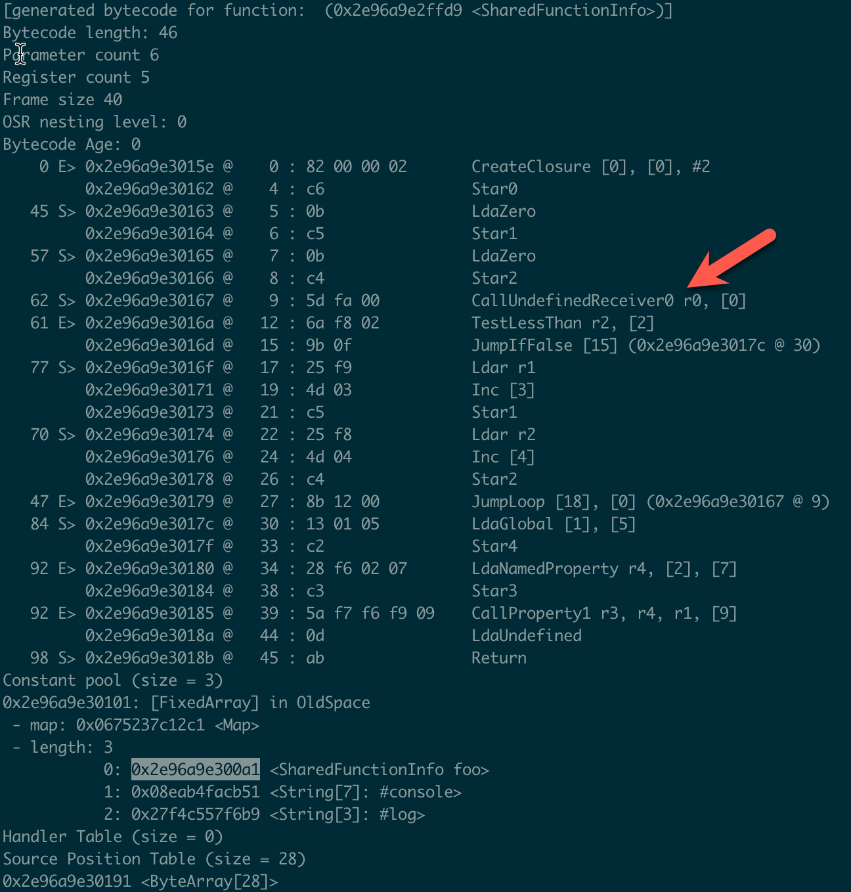
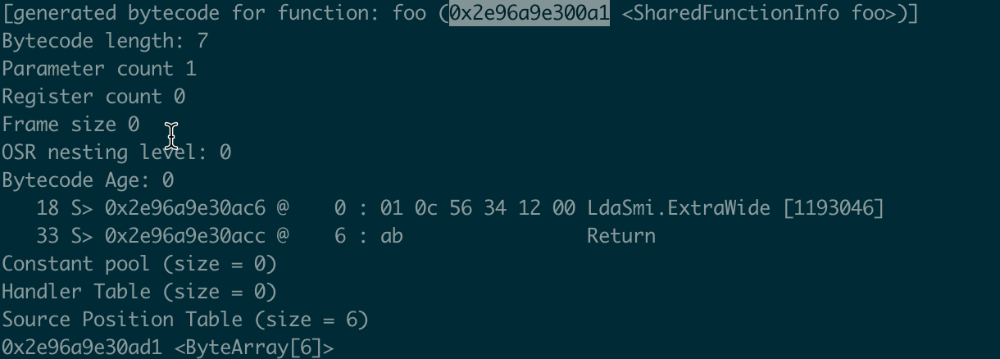
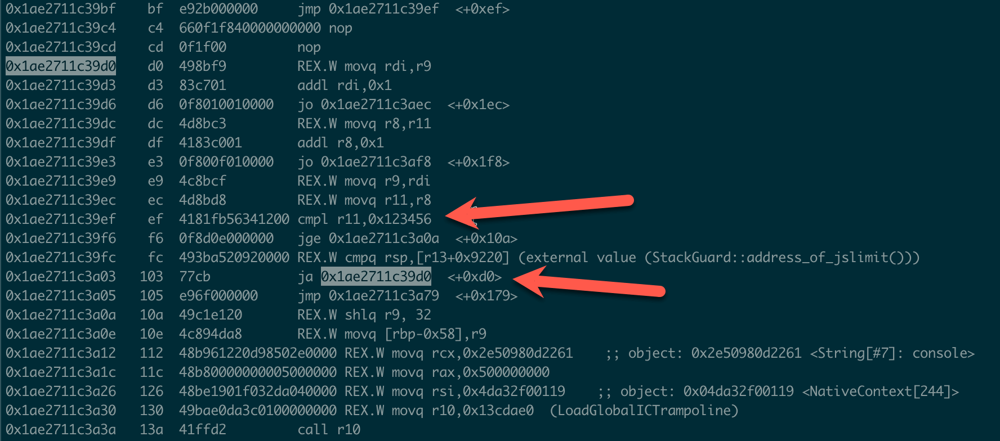
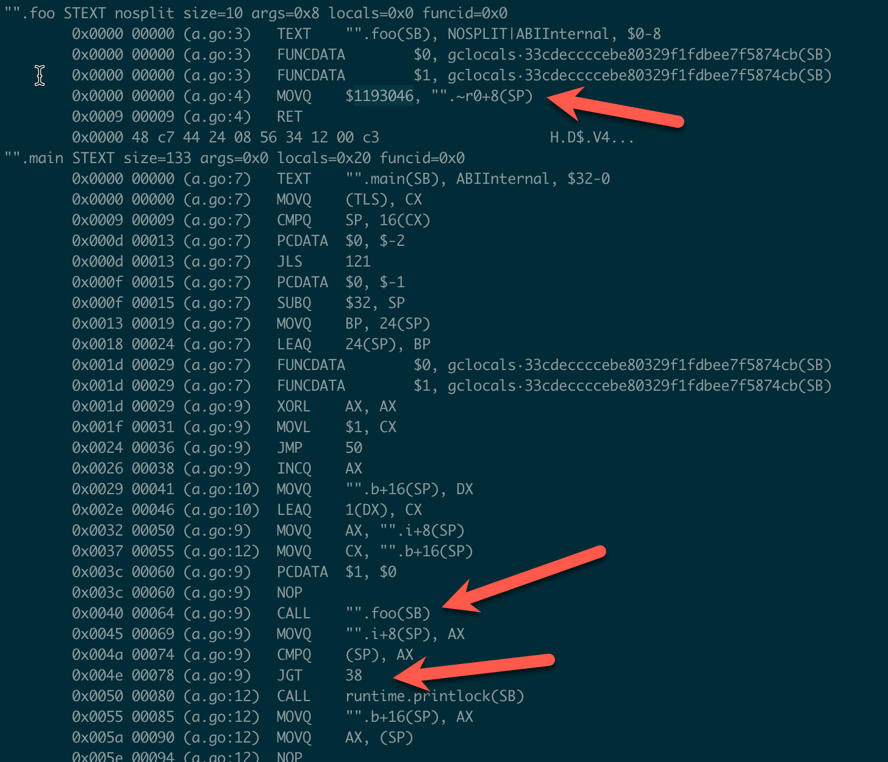
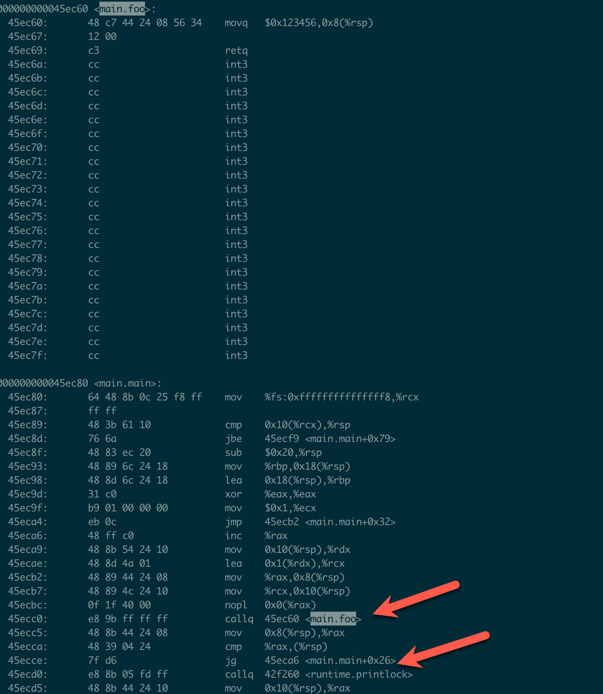

## TL;DR
编译器优化不是万能的，有些对程序员非常简单的点，对编译器来说却很难。往往这些细节点在平时很容易被忽视。更重要的是，往往在小数据量的时候不会被发现，而当复杂度是指数增长时，在稍微大一些的数据量就会造成性能问题。所以我们程序员需要重视这些细节点，与编译器互相合作，才能编写出高性能的代码。

## 背景
周末无意间发现一个性能问题，简化之后的版本大概如下
```js
var a = 0;
for (var i = 0; i < foo(); i++) {
  a++;
}
```

当回过头来细看这个问题也不难发现，问题的原因是因为把`foo`放在for循环的判断条件里面，它会在每一轮循环中都执行。

因为**此处每次执行foo的返回值是不变的，作为人类很容易就可以判断出来**，所以脑里面冒出一些问题：
1. js解释运行时是不是每个循环都会执行foo？
2. 运行多次后JIT获取runtime信息后会不会做优化？
3. 编译型语言像c和golang是否会做优化？

## 探索
### v8 字节码（bytecode）

```js
function foo(){
  return 0x123456
}

var a = 0
for(var i=0; i<foo(); i++){
  a++
}
```

使用v8编译代码
```
node --print-bytecode a.js
```





可以看到v8字节码里foo函数在每个循环中都会被调用。

### v8 机器码（optimized code / X86 machine code）

我们知道v8采用了JIT，会在Ignition多次解析运行字节码后，收集runtime的信息，如果可以做优化，会将信息传递给TurboFan，将字节码编译成机器码来运行，提高性能。

那在转换成机器码之后是否会对这个问题做优化呢？

运行
```
node --print-opt-code a.js
```

发现其也只是做了inline，foo仍然在每个循环中都执行。



### Golang 汇编（Plan9）
那在AOT的编译型语言中，是否会有不一样的呢？

```go
package main

func foo() int{
  return 0x123456
}

func main(){
  var b int=1
  for i:=0; i<foo(); i++ {
    b++
  }
  //...
}
```

运行如下指令，`-l`为关闭inline
```
go tool compile -l -S a.go
```

可以发现foo依旧存在每个循环中，编译器仍然没有对其做优化（这里注意Golang使用的Plan9汇编是Intel operand order的，见下图CMP指令）


### Golang 反汇编（X86 machine code）
由于Golang的汇编跟最终运行在机器上的机器码还不是一一对应的，想要最终确认一下最终可执行文件中是否还是没有做优化。

运行编译，接着用objdump反汇编
```
go build -gcflags '-l' -o a_l a.go
objdump -d a_l
```



结果依旧没有如愿

## 解决

解决方案非常简单，因为我们知道foo每次调用的返回值是一样的，所以可以先提前计算它。

```js
var a = 0;
var length = foo();
for (var i = 0; i < length; i++) {
  a++;
}
```

那么为什么对于程序员来说这么明显的问题，编译器优化却熟视无睹呢？

有一个原因主要是，对于编译器来说，这其实是一个非常难的问题，需要大量的上下文信息，举个最简单的例子，`foo`可能会有副作用

```js
var global_cnt = 0
function foo(){
  global_cnt++
}
```

**此时如果编译器帮你做了这个优化，那就会导致优化前和优化后的表现是不一致的，所以编译器会选择不去做这个优化。**

## Why it matter？
可能有些同学会说，这个问题不严重，就算它每一个循环都执行也不会有问题。

那我们可以来看一下一个更加具体的例子，数一下有多少个💰，并对比两种方法。

```js
var Benchmark = require("benchmark");
var suite = new Benchmark.Suite();

function getCharacterLength(str) {
  return [...str].length;
}

var demoWithFuncInLoop = (str) => {
  var a = 0;
  for (var i = 0; i < getCharacterLength(str); i++) {
    a++;
  }
};

var demoWithoutFuncInLoop = (str) => {
  var a = 0;
  var length = getCharacterLength(str);
  for (var i = 0; i < length; i++) {
    a++;
  }
};

var strArr = [1, 2, 3, 4].map((i) => {
  return new Array(10 ** i+1).join("💰");
});

strArr.forEach((str, i) => {
  suite.add(`in: string length 1e${i+1}`, function () {
    demoWithFuncInLoop(str);
  });
});

strArr.forEach((str, i) => {
  suite.add(`out: string length 1e${i+1}`, function () {
    demoWithoutFuncInLoop(str);
  });
});

suite
  .on("cycle", function (event) {
    console.log(String(event.target));
  })
  .run({ async: true });
```

下面是执行后的benchmark，我们可以看到，**循环调用`getCharacterLength`是很可怕的O(n^2)的复杂度，消耗的时间也是指数型上升的。如果我们不小心写了这样的代码，那在1e5个💰时，大概需要200s+才能够运行完上述逻辑；如果是1e6，则需要6小时，基本上这段代码是不可用的状态。而正确的方式（out）大概是个O(n)的复杂度，性能是(in)的10000倍**。

```
in: string length 1e1 x 493,563 ops/sec ±0.31% (87 runs sampled)
in: string length 1e2 x 6,317 ops/sec ±0.50% (96 runs sampled)
in: string length 1e3 x 66.25 ops/sec ±0.96% (68 runs sampled)
in: string length 1e4 x 0.43 ops/sec ±0.85% (6 runs sampled)
out: string length 1e1 x 5,359,604 ops/sec ±0.26% (97 runs sampled)
out: string length 1e2 x 573,066 ops/sec ±0.13% (95 runs sampled)
out: string length 1e3 x 61,642 ops/sec ±0.20% (93 runs sampled)
out: string length 1e4 x 4,214 ops/sec ±0.55% (93 runs sampled)
```

## 总结
编译器优化不是万能的，有些对程序员非常简单的点，对编译器来说却很难。往往这些细节点在平时很容易被忽视。更重要的是，往往在小数据量的时候不会被发现，而当复杂度是指数增长时，在稍微大一些的数据量就会造成性能问题。所以我们程序员需要重视这些细节点，与编译器互相合作，才能编写出高性能的代码。